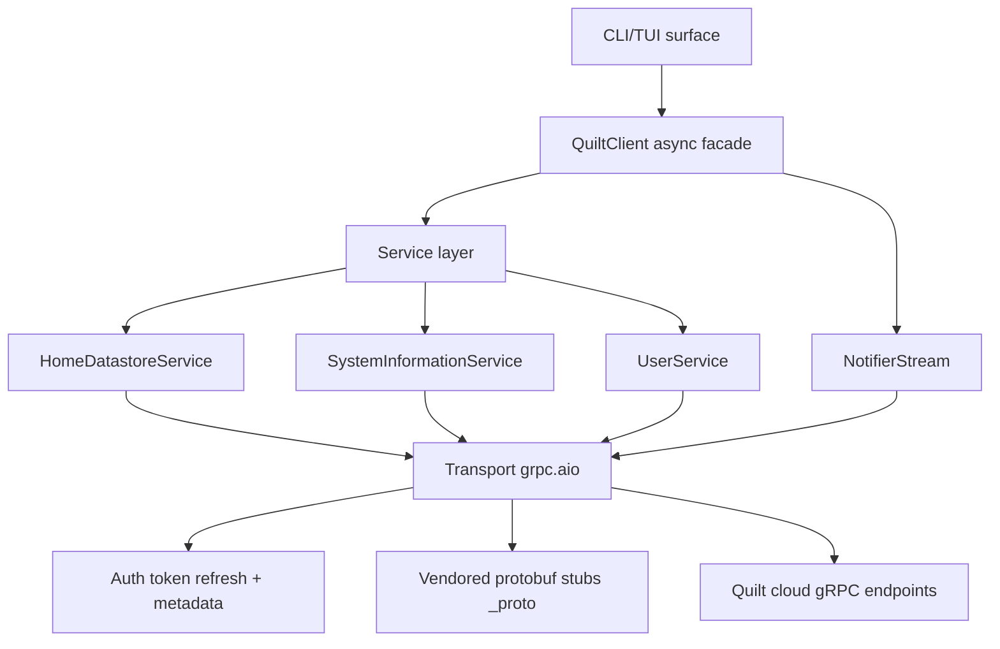

# quilt-hp-python

Async Python client library for [Quilt](https://www.quilt.com/) mini-split HVAC systems.

Communicates with the Quilt cloud API via gRPC to control spaces (rooms), indoor units,
comfort presets, schedules, and stream real-time updates.

## Installation

```bash
pip install quilt-hp-python
```

With the optional CLI:

```bash
pip install "quilt-hp-python[cli]"
```

## Quick Start

```python
import asyncio
from quilt_hp import QuiltClient

async def main():
    async with QuiltClient("user@example.com") as client:
        await client.login(otp_callback=lambda email: input(f"OTP for {email}: "))

        # List spaces
        for space in await client.list_spaces():
            print(f"{space.name}: {space.state.ambient_temperature_c}°C")

        # Set a room to COOL at 22°C
        from quilt_hp.models.enums import HVACMode
        spaces = await client.list_spaces()
        await client.set_space(spaces[0].id, mode=HVACMode.COOL, cool_setpoint_c=22.0)

        # Stream real-time updates
        spaces = await client.list_spaces()
        topics = [f"hds/space/{s.id}" for s in spaces]
        async with client.stream(topics) as stream:
            stream.on_space_update(lambda s: print(f"{s.name}: {s.state.ambient_temperature_c}°C"))
            await asyncio.sleep(60)

asyncio.run(main())
```

## CLI

```bash
# Authenticate (caches tokens for subsequent commands)
quilt login --email user@example.com

# Full system inventory + telemetry (summary)
quilt info

# Full system snapshot as JSON for automation
quilt info --output json

# All device/entity IDs (includes update entities)
quilt devices

# Current sensor values + setpoints
quilt values

# Machine-readable values for scripting
quilt values --output json

# Energy usage
quilt energy --period week

# Set a room to cooling mode
quilt set "Living Room" --mode cool --cool 22
```

## Architecture



## Development

```bash
git clone https://github.com/eman/quilt-hp-python.git
cd quilt-hp-python
python -m venv .venv
source .venv/bin/activate
pip install -e ".[dev,cli]"

# Run checks
ruff check src/ tests/
ruff format --check src/ tests/
mypy src/quilt_hp/
pytest
python -m build
twine check dist/*

# Recompile protobuf stubs (requires grpcio-tools)
# Proto sources are vendored in ./proto/cleaned for standalone use.
# Optional but recommended: install protobuf includes (e.g. `brew install protobuf`)
./scripts/regen_protos.sh

# Build project docs (MkDocs Material)
pip install -e ".[docs]"
python scripts/check_docs_nav.py
mkdocs build --strict
```

## Release Process

This project uses [Keep a Changelog](https://keepachangelog.com/) + [SemVer](https://semver.org/).

1. Update `CHANGELOG.md` by moving release notes from `## [Unreleased]` to a new `## [X.Y.Z]` section.
2. Bump `project.version` in `pyproject.toml` to `X.Y.Z`.
3. Merge to `main`, then create and push an annotated tag:

```bash
git tag -a vX.Y.Z -m "Release vX.Y.Z"
git push origin vX.Y.Z
```

Tag pushes trigger `.github/workflows/release.yml`, which:
- verifies generated protobuf stubs are already in sync (no publish-time regen)
- validates tag/version/changelog consistency
- runs quality gates (lint, format, type-check, tests, package build, docs build)
- creates a GitHub Release from the tag
- publishes to PyPI via trusted publishing (`id-token: write`, no API token secrets)

Recommended proto workflow:
1. If `proto/cleaned/*.proto` changes, run `./scripts/regen_protos.sh`.
2. Commit both proto source and generated `src/quilt_hp/_proto/*` changes.
3. Open PR; CI enforces proto sync by regenerating and diff-checking.

Repository maintainers must configure PyPI Trusted Publishing for this repository/workflow and approve the `pypi` environment as needed.

## License

MIT
