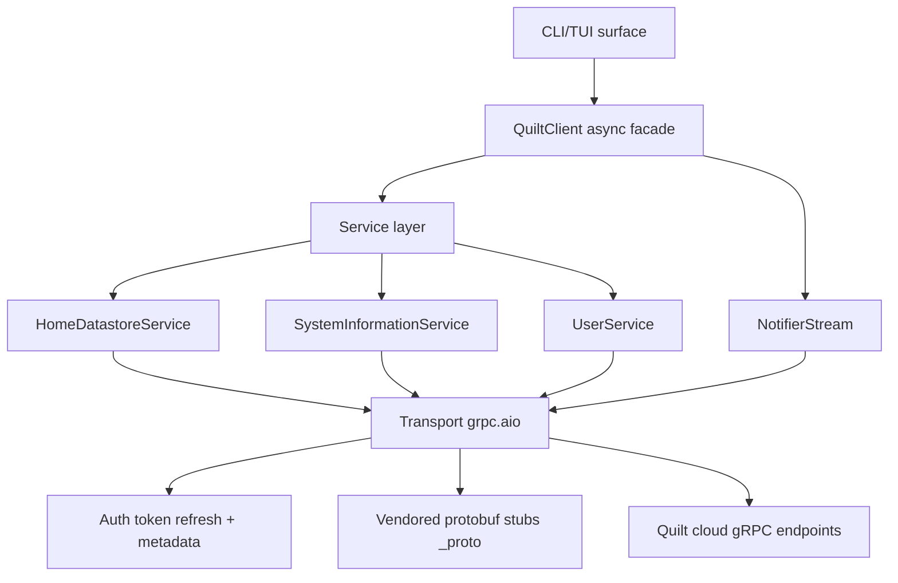

# Architecture

This section explains how the project is layered and how data and control flow through the system.

Scope:

- package and runtime layering
- snapshot and stream data model behavior
- high-level control/data flow

Start here:

- [Architecture and layering](layering.md)
- [Source-to-documentation inventory](source-inventory.md)
