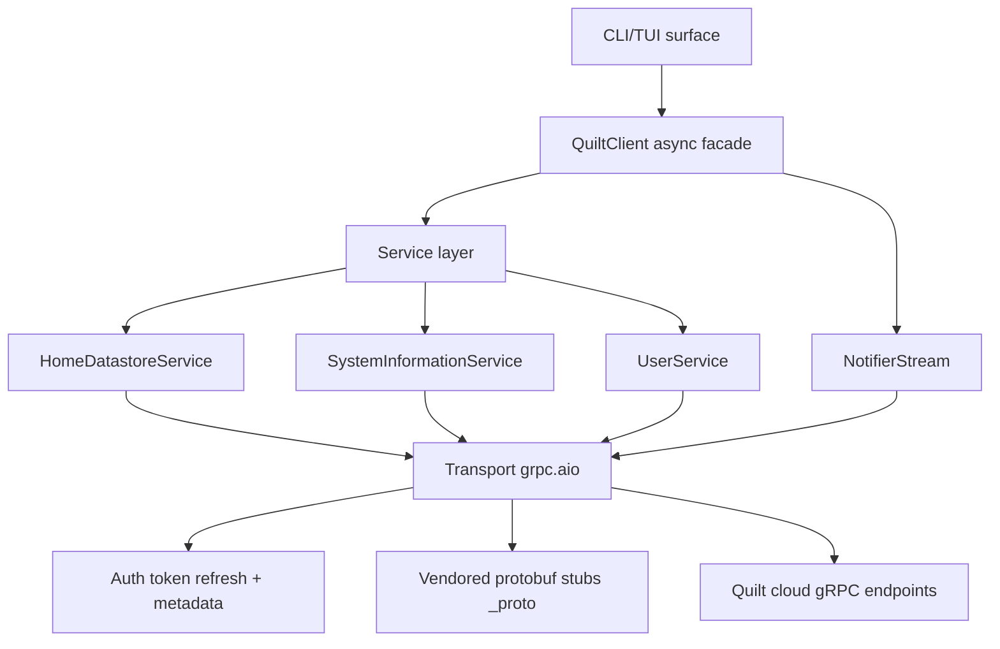

# Architecture

## Layer responsibilities

The library is organised into five distinct layers, each with a well-defined responsibility. Understanding the layering helps when deciding where to make changes and why things are structured the way they are.

**CLI/TUI surface** (`src/quilt_hp/cli/`). The outermost layer. `main.py` provides Typer commands (`login`, `info`, `devices`, `values`, `energy`, `set`, `stream`, `tui`) that drive `QuiltClient` and format output. `tui.py` provides a Textual-based full-screen dashboard. Neither file contains business logic — they translate user input into `QuiltClient` calls. `store.py` and `settings.py` handle on-disk state (token cache and saved email/home preferences) that the CLI layer owns.

**High-level async façade** (`QuiltClient` in `client.py`). The primary user-facing API. `QuiltClient` owns the authentication lifecycle, manages the single gRPC channel, lazily creates service instances, and exposes a convenient method surface that hides proto message construction. It also owns the snapshot TTL cache and the snapshot-invalidation logic. Library consumers interact with this layer exclusively — they should have no reason to touch service classes or proto objects directly.

**Service layer** (`src/quilt_hp/services/`). Thin async wrappers around gRPC stubs. Each service class accepts a `grpc.aio.Channel`, constructs a stub, and translates between Python domain objects and proto messages. `HomeDatastoreService` handles snapshot retrieval and all entity mutations. `SystemInformationService` handles system listing and energy metrics. `UserService` handles user info. `NotifierStream` (also in the services package) manages the bidirectional notification stream, including the reconnect loop and callback dispatch.

**Transport/auth** (`transport.py`, `auth.py`, `tokens.py`). The infrastructure layer. `transport.py` creates the TLS gRPC channel and houses `_AuthInterceptor`, which injects `authorization` and `x-quilt-app-version` headers into every outbound call and retries once on `UNAUTHENTICATED`. `auth.py` implements the three-step token resolution: cache → refresh → OTP. `tokens.py` defines the data types (`CachedTokens`, `TokenStore`, `LegacyTokenStore`) and the hook/policy protocols used to instrument the auth flow.

**Wire artifacts** (`src/quilt_hp/_proto/`). Generated protobuf stubs vendored into the package. These are not hand-written; they are produced by `./scripts/regen_protos.sh` from the proto definitions in `proto/cleaned/`. Vendoring means the package has no build-time dependency on `protoc` and works correctly in any Python environment.

## Design constraints

The library is **async-only**. There is no synchronous wrapper. All public methods on `QuiltClient` are coroutines that must be awaited, and `QuiltClient` must be used as an async context manager (or at minimum, the channel must be closed by calling `__aexit__`).

There is **no global state**. The gRPC channel, auth tokens, and cached snapshot all live on the `QuiltClient` instance. You can run multiple instances against different accounts or environments simultaneously without interference.

**Token storage and auth UI are injectable**. The core library defines the `TokenStore` protocol but does not implement persistence — that is the CLI's `FileStore`. Similarly, the OTP prompt is not built-in; callers provide an `otp_callback`. This design lets library consumers integrate with any storage backend (database, HA secure storage, system keychain) and any UI (stdin prompt, web form, push notification).

## Key data models

`SystemSnapshot` is the central in-memory model. A single `GetHomeDatastoreSystem` RPC returns the entire state of one Quilt installation as a flat set of entity lists. `SystemSnapshot.from_proto()` builds the Python model, cross-references comfort settings to resolve `active_comfort_setting_type` on spaces, and passes hardware maps so outdoor units and controllers include hardware info.

The `apply_*` family of methods on `SystemSnapshot` (`apply_space`, `apply_indoor_unit`, `apply_outdoor_unit`, `apply_controller`, etc.) handle the merge of sparse stream diffs into the snapshot. Proto3 stream diffs are partial — only changed fields are sent. A controls-only diff for a space will have `hvac_mode=UNSPECIFIED` and `ambient_temperature_c=None` because those fields were absent from the wire diff. Without merging, those zero-value defaults would overwrite real data. The `apply_*` methods detect absent sub-messages via sentinel values and preserve existing data where the diff is silent.

## Documentation in this section

- [Architecture and layering](layering.md) — deep dive into each layer, channel lifecycle, sequence diagrams.
- [Source inventory](source-inventory.md) — complete module-by-module reference for navigating the codebase.
