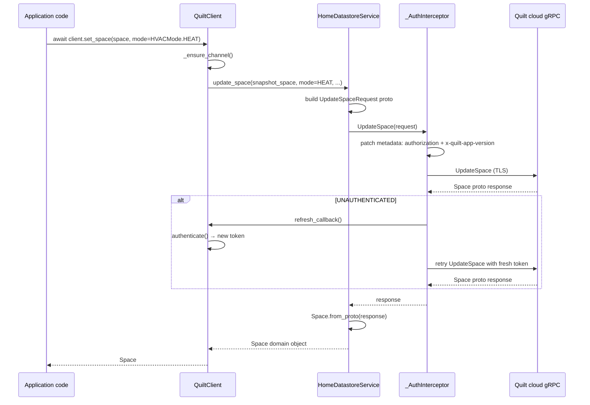

# Architecture and layering

This page walks through each layer of the library in depth, explains how data flows from a user call through to the Quilt cloud API and back, and covers the subtleties of the snapshot-and-stream data model.

## The layers

### CLI/TUI surface

`src/quilt_hp/cli/main.py` defines the Typer application. Commands such as `login`, `devices`, `values`, `set`, `stream`, and `tui` are thin orchestrators: they resolve the user's email and optional home filter, construct a `QuiltClient`, call one or a few methods, and format the result using Rich.

`src/quilt_hp/cli/tui.py` implements the Textual terminal UI. It creates a `QuiltClient`, subscribes to the `NotifierStream`, and drives widget updates from stream callbacks — a pattern any TUI integrator can copy.

`src/quilt_hp/cli/store.py` provides `FileStore`, the CLI's implementation of `TokenStore`. It persists `CachedTokens` as JSON at `~/.config/quilt-hp/tokens.json` with `chmod 0o600`. It is the only place in the project that touches the filesystem for auth data.

`src/quilt_hp/cli/settings.py` provides `SettingsStore`, which persists the last-used email and home filter so subsequent CLI invocations can omit `--email`.

### QuiltClient

`QuiltClient` is the façade. It:

1. Holds the gRPC channel (created lazily at first login, or explicitly via `_ensure_channel()`).
2. Holds the current JWT token as `self._token`.
3. Implements `get_current_token() -> str`, the callable the transport interceptor calls to get the current token for metadata injection.
4. Instantiates `HomeDatastoreService`, `SystemInformationService`, and `UserService` against the channel.
5. Exposes domain-level methods (`list_spaces`, `set_space`, `set_indoor_unit`, `get_energy`, `stream`, etc.) that hide proto message construction.
6. Owns the snapshot TTL cache: `self._snapshot_cache` and `self._snapshot_cached_at`. When `snapshot_ttl_s > 0`, repeated `get_snapshot()` calls within the TTL window return the cached copy without a network call.

### Service layer

Each service class takes a `grpc.aio.Channel`, constructs the corresponding generated stub, and provides `async` methods that send proto requests and return Python domain objects.

`HomeDatastoreService` wraps:
- `GetHomeDatastoreSystem` → returns `SystemSnapshot`
- `UpdateSpace` → returns `Space`
- `UpdateIndoorUnit` → returns `IndoorUnit`
- `UpdateComfortSetting` → returns `ComfortSetting`
- `CreateScheduleDay`, `UpdateScheduleDay`, `DeleteScheduleDay`
- `CreateScheduleWeek`, `UpdateScheduleWeek`, `DeleteScheduleWeek`
- `UpdateLocation` (for pausing/resuming schedules)

`SystemInformationService` wraps `ListSystems` and `GetEnergyMetrics`.

`UserService` wraps `GetLoggedInUser`, `UpdateLoggedInUser`, `GetUserAttributes`, and `PatchUserAttributes`.

`NotifierStream` is not a stub wrapper in the traditional sense — it manages the bidirectional stream lifecycle directly, including the reconnect loop. See [streaming protocol](../protocol/streaming-protocol.md) for details.

### Transport/auth

`create_channel()` in `transport.py` constructs a `grpc.aio.secure_channel` with TLS credentials and attaches an `_AuthInterceptor`. The interceptor implements all four gRPC interceptor interfaces (unary-unary, unary-stream, stream-unary, stream-stream). For unary RPCs it patches outbound metadata to include `authorization` and `x-quilt-app-version`, and on `UNAUTHENTICATED` response it triggers the refresh callback and retries once. For streaming RPCs it patches metadata on the way out.

`auth.py` implements `authenticate()`, the three-step token resolution function. All auth logic lives here; `QuiltClient` just calls it.

`tokens.py` defines the protocols (`TokenStore`, `LegacyTokenStore`, `TokenRefreshHooks`, `TokenRefreshPolicy`) and data types (`CachedTokens`, `TokenRefreshContext`). No business logic — pure contracts and data.

### Wire artifacts

`src/quilt_hp/_proto/` contains the generated `*_pb2.py`, `*_pb2_grpc.py`, and `*_pb2.pyi` files. These are produced from `proto/cleaned/*.proto` by `./scripts/regen_protos.sh` and committed to the repo so the package can be installed without a proto compiler. The stubs use relative imports (rewritten by the script) so they work correctly inside the `_proto` sub-package.

## Channel lifecycle

The channel is created lazily on first `login()` call. `login()` calls `_ensure_channel()` which, if no channel exists, calls `create_channel(self, ...)`, then initialises the three service instances against it. The channel remains open for the lifetime of the `QuiltClient` instance.

When `QuiltClient` is used as an async context manager, `__aexit__` closes the channel:

```python
async def __aexit__(self, *_: object) -> None:
    if self._channel is not None:
        await self._channel.close()
```

If you use `QuiltClient` without the context manager, call `await client._channel.close()` yourself or the underlying gRPC connection will not be cleanly torn down.

## SystemSnapshot and stream diffs

The Quilt API has two data paths: the snapshot RPC and the stream.

**Snapshot** (`GetHomeDatastoreSystem`): a single unary RPC that returns the full state of the system. All entities are present. Hardware lookup maps are included (`outdoor_unit_hardware`, `controller_hardware`) so models can be enriched at parse time. `SystemSnapshot.from_proto()` handles this enrichment.

**Stream** (`NotifierService.Subscribe`): a bidirectional stream that pushes change notifications as they happen. Each notification contains a *sparse diff* — a proto message with only the changed fields set. Fields that did not change are absent; in proto3, absent fields deserialise to their default values (empty string, 0, `None` for optional sub-messages).

The `apply_*` family of methods exists to merge these sparse diffs correctly. For example, `apply_space()` detects whether the `controls` sub-message was present in the diff by checking `space.controls.hvac_mode != HVACMode.UNSPECIFIED` — a real space always has a non-UNSPECIFIED mode, so UNSPECIFIED means the controls block was absent. Similarly, a space's `state.ambient_temperature_c` is only present when `state.updated_ts` is set, so absence is detected by `space.state.ambient_temperature_c is None`.

Stream events also lack comfort-setting context, so `enrich_space()` resolves the `active_comfort_setting_type` from the snapshot's comfort-setting list after merging. This is what makes `space.is_away` and `space.is_off` reliable on stream-updated spaces.

The typical pattern for an integration that uses both is:

```python
snapshot = await client.get_snapshot()

def on_space_update(space: Space) -> None:
    updated = snapshot.apply_space(space)  # merge diff + enrich
    # updated now has correct is_away, is_off, and preserved sub-messages

stream = client.stream(snapshot.stream_topics())
stream.on_space_update(on_space_update)
await stream.run_forever()
```

`snapshot.stream_topics()` returns the complete list of `hds/<type>/<id>` topic strings for every entity in the snapshot.

## Typical read/write flow


