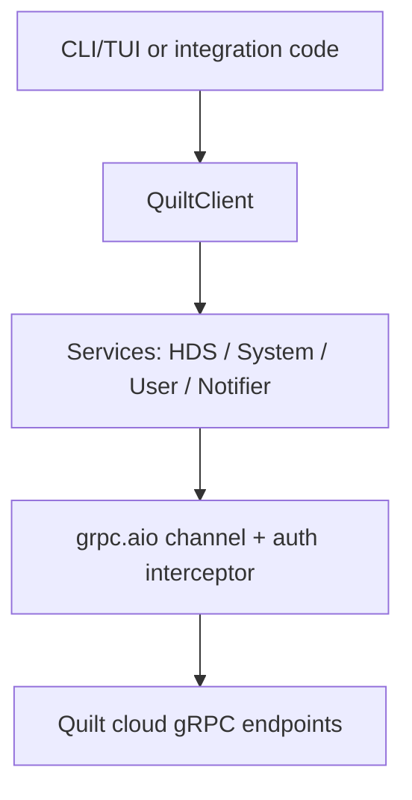

# Architecture and layering

The stack is intentionally layered:

1. **CLI/TUI surface** (`src/quilt_hp/cli/`)
   - Typer commands in `main.py`
   - Textual app/screens in `tui.py`
2. **High-level async façade** (`QuiltClient`)
   - Authentication lifecycle
   - gRPC channel lifecycle
   - service orchestration and convenience methods
3. **Service layer** (`src/quilt_hp/services/`)
   - `HomeDatastoreService` (snapshot + control/update RPCs)
   - `SystemInformationService` (systems + energy metrics)
   - `UserService` (logged-in user)
   - `NotifierStream` (bidirectional streaming subscriptions)
4. **Transport/auth** (`transport.py`, `auth.py`, `tokens.py`)
   - Cognito OTP / refresh-token flow
   - metadata injection and retry-on-`UNAUTHENTICATED`
5. **Wire artifacts** (`src/quilt_hp/_proto/`)
   - vendored generated stubs (`*_pb2.py`, `*_pb2_grpc.py`, `*_pb2.pyi`)

## Snapshot + stream model

`SystemSnapshot` is the central in-memory model of a system state.

- Initial data comes from `GetHomeDatastoreSystem`.
- Stream updates are **sparse diffs**.
- `SystemSnapshot.apply_*` methods merge sparse updates so absent fields do not overwrite valid existing state.

This is important for correctness in long-running integrations and the TUI.

## Control/data flow

