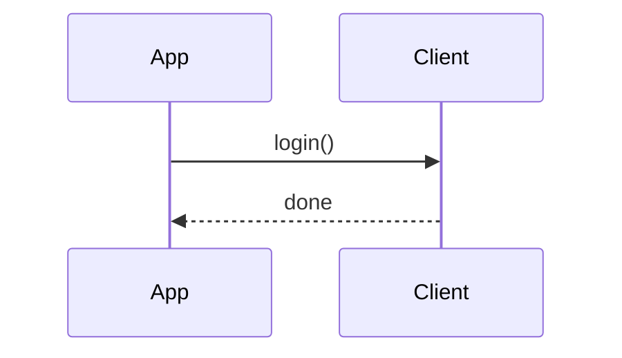

# Documentation standards

This page defines the writing and structural conventions used across the `quilt-hp-python` docs. Follow these standards when adding or editing documentation.

---

## Guiding principle

Every page should answer: *"What does this actually do and how do I use it?"* Bullet-point summaries that could apply to any library are not useful. Prefer:

- **Prose paragraphs** that explain behavior with context and nuance.
- **Working code examples** from real source code, not pseudocode.
- **Exact values** — endpoint hostnames, timeout constants, buffer durations, field names — drawn from the source.
- **Behavioral semantics** — what happens at runtime, not just what the interface looks like.

---

## File locations and naming

All documentation files are listed in `mkdocs.yml` under the `nav:` key. **Do not add, remove, or rename documentation files** without updating `mkdocs.yml` and running `python3 scripts/check_docs_nav.py` to verify consistency.

File names use lowercase kebab-case: `transport-auth.md`, `hds-entities.md`.

---

## Page structure

Every page should have:

1. A level-1 heading (`# Title`) that matches the nav label.
2. A brief introductory sentence or paragraph (no heading above it).
3. Level-2 headings (`##`) for major sections.
4. Level-3 headings (`###`) for subsections.
5. No heading deeper than level 4.

Avoid floating sections that belong to no parent heading. Every code block that shows a public API call should be executable as-is or clearly annotated with what is missing.

---

## Code examples

Use fenced code blocks with a language tag:

````markdown
```python
async with QuiltClient("you@example.com") as client:
    await client.login()
```
````

Rules for code examples:

- Import every symbol used. A reader should be able to copy the block and run it.
- Use `...` (ellipsis) as a placeholder for omitted logic, never `# ...` or `TODO`.
- Use f-strings for interpolation, not `%` formatting.
- Do not show internal-only APIs (underscore-prefixed) in examples aimed at application developers.

---

## Mermaid diagrams

The site is configured with `pymdownx.superfences` and the Mermaid extension. Use diagrams to illustrate flows that are hard to express in prose:

````markdown

````

Keep diagrams focused. A diagram with more than ~12 nodes usually needs splitting or a different representation.

---

## API reference tables

For API reference pages, document every parameter and field. Use a two-column Markdown table:

```markdown
| Parameter | Description |
|-----------|-------------|
| `email` | Account email address used for authentication. |
| `token_store` | Optional `TokenStore` for cross-process token persistence. |
```

Always include the type or valid values when not obvious from the name.

---

## Accuracy requirements

Documentation must reflect the actual source code at time of writing. Verify:

- Constant values (timeouts, buffer durations, Cognito IDs) against `const.py`.
- Method signatures against the source (not docs that may be stale).
- Default parameter values and their behavioural implications.
- Exception types raised — check both the method body and called service layers.

If you are uncertain about a detail, check the source rather than guessing.

---

## Terminology

Use these terms consistently throughout the docs:

| Term | Meaning |
|------|---------|
| **system** | The top-level Quilt installation (one controller, multiple IDUs) |
| **space** | A room or floor zone; leaf spaces have `parent_space_id` |
| **indoor unit (IDU)** | A single fan-coil unit within a space |
| **outdoor unit (ODU)** | The compressor unit shared across IDUs |
| **comfort setting** | A named HVAC preset (mode + setpoints + fan speed) |
| **snapshot** | A point-in-time `SystemSnapshot` containing all entity state |
| **stream** | The bidirectional gRPC stream delivering real-time diffs |
| **topic** | A subscription string like `system/<id>/spaces/<sid>` |

---

## What not to write

- Headings like "Overview" or "Introduction" for the first section — use the page title.
- Placeholder sections with "TODO" or "Coming soon".
- Generic advice that applies to all Python libraries (e.g., "Make sure you have Python installed").
- Repeating the same information in multiple places — cross-link instead.
