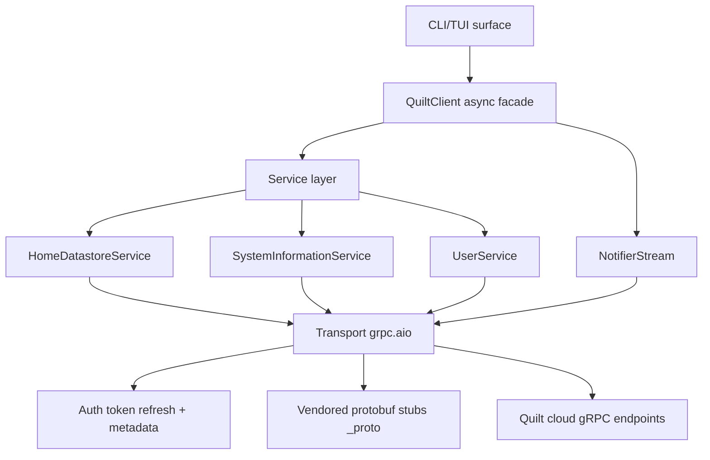

# Architecture

quilt-hp-python is a layered async Python library. Understanding how those layers fit together helps you decide where to make changes, why certain design constraints exist, and what each component is responsible for.

---

## Why the library is layered the way it is

The five layers reflect the different rates at which things change and the different reasons to change them.

The **CLI/TUI surface** (`src/quilt_hp/cli/`) changes when user-facing behaviour changes, such as command names, output formatting, and interactive prompts. It is intentionally thin: `main.py` translates user intent into `QuiltClient` calls; it contains no business logic. This means you can use the library from any context (a Python script, a Home Assistant component, a FastAPI service) without pulling in CLI concerns.

The **`QuiltClient` façade** (`client.py`) changes when the public API surface changes, such as new high-level methods, new constructor parameters, and new caching behaviour. It owns the authentication lifecycle, manages the single gRPC channel, and exposes convenient methods that hide proto message construction. Library consumers interact with this layer exclusively; they should never need to touch service classes or proto objects directly.

The **service layer** (`src/quilt_hp/services/`) changes when the gRPC contract changes, such as new RPC methods or changed request and response shapes. Each service class accepts a `grpc.aio.Channel`, constructs a stub, and translates between Python domain objects and proto messages. This translation is the only job of the service layer.

The **transport/auth layer** (`transport.py`, `auth.py`, `tokens.py`) changes when the authentication mechanism or connection behaviour changes, such as a new Cognito flow, different keepalive settings, or a new metadata header. This layer is infrastructure: it knows nothing about HVAC, comfort settings, or schedules.

The **wire artifacts** (`src/quilt_hp/_proto/`) change when the proto definitions change. These are generated files, not hand-written code. They are isolated in their own sub-package precisely so the rest of the codebase does not need to import them directly.

---

## What each layer does

### CLI/TUI surface

`cli/main.py` provides Typer commands (`login`, `info`, `devices`, `values`, `energy`, `set`, `stream`, `tui`) that drive `QuiltClient` and format output using Rich. `cli/tui.py` provides a Textual full-screen dashboard. Neither file contains business logic.

`cli/store.py` provides `FileStore`, the CLI's `TokenStore` implementation. It is the only place in the project that writes auth data to disk.

`cli/settings.py` provides `SettingsStore`, which persists the last-used email and home filter so they don't need to be specified on every invocation.

### QuiltClient

`QuiltClient` is the façade. It holds the gRPC channel (created lazily at the first `login()` call), stores the current JWT as `self._token`, and implements `get_current_token()`. The transport interceptor uses that callable for metadata injection on every outbound call. It instantiates the three service classes against the channel and owns the snapshot TTL cache.

### Service layer

Each service class is a thin async wrapper. `HomeDatastoreService` handles snapshot retrieval and all entity mutations. `SystemInformationService` handles system listing and energy metrics. `UserService` handles user info. `NotifierStream` manages the bidirectional notification stream including the reconnect loop and callback dispatch.

### Transport/auth

`transport.py` creates the TLS `grpc.aio.secure_channel` and attaches `_AuthInterceptor`. The interceptor implements all four gRPC interceptor interfaces. For unary RPCs it patches outbound metadata (`authorization` and `x-quilt-app-version`) and retries once on `UNAUTHENTICATED`. For streaming RPCs it patches metadata only. The stream handles its own reconnect.

`auth.py` implements `authenticate()`, the three-step token resolution (cache → refresh → OTP). All auth logic lives here.

`tokens.py` defines the data types (`CachedTokens`, `TokenRefreshContext`) and protocols (`TokenStore`, `LegacyTokenStore`, `TokenRefreshHooks`, `TokenRefreshPolicy`). There is no business logic here, only contracts.

### Wire artifacts

`src/quilt_hp/_proto/` contains generated `*_pb2.py`, `*_pb2_grpc.py`, and `*_pb2.pyi` files produced by `./scripts/regen_protos.sh` from the proto definitions in `proto/cleaned/`. These are committed so the package installs without needing `protoc`.

---

## The async-first design constraint

The library is **async-only**. There is no synchronous wrapper. All public methods on `QuiltClient` are coroutines that must be awaited, and `QuiltClient` must be used as an async context manager.

This constraint exists because the library's primary use cases, such as long-running daemons, Home Assistant integrations, and TUI applications, are all inherently async. A synchronous wrapper that uses `asyncio.run()` internally would prevent callers from running the library inside an existing event loop. Providing a sync wrapper that spawns a new thread with its own loop creates race conditions around shared state (particularly the gRPC channel). The async-only design is simpler and more correct.

The gRPC layer itself is `grpc.aio` (the asyncio-native API), which means true async I/O without threads for unary calls and native async iteration for streaming. `grpc.aio` is stable as of `grpcio >= 1.32`.

---

## Why transport and auth are separate

Auth (`auth.py`) and transport (`transport.py`) are in separate modules even though the transport uses auth. This is because:

- Auth is about identity: converting credentials into tokens and managing their lifecycle. It depends on AWS Cognito (via `boto3`).
- Transport is about communication: creating the gRPC channel and injecting metadata. It depends on `grpcio`.

Keeping them separate makes each testable independently. You can test the auth flow without a real gRPC channel, and you can test the interceptor with a mock token provider.

---

## Why gRPC

Quilt's mobile applications communicate with the cloud backend over gRPC. Using gRPC lets the library speak the same protocol, which is the most stable and complete interface available.

gRPC also provides the bidirectional streaming used for real-time notifications, which is a core feature of the library. A REST API would require polling, which would either miss fast changes or generate excessive traffic. The `NotifierService.Subscribe` bidirectional stream lets the server push changes the moment they happen.

For more on the gRPC design decisions, see [gRPC and protobuf](grpc-and-protobuf.md).

---

## No global state

The gRPC channel, auth tokens, and cached snapshot all live on the `QuiltClient` instance. You can run multiple instances against different accounts or environments simultaneously without interference. This is not just a design goal. The structure enforces it: there are no module-level variables that hold connection or auth state.

---

## Token storage and auth UI are injectable

The core library defines the `TokenStore` protocol but does not implement persistence. That is the CLI's `FileStore`. Similarly, the OTP prompt is not built in. Callers provide an `otp_callback`. This lets library consumers integrate with any storage backend (database, HA persistent storage, system keychain) and any UI (stdin prompt, web form, push notification) without forking the library.

To implement a custom token store, see [Authenticate and manage tokens](../how-to/authenticate.md). For the `TokenStore` protocol definition, see [Token management reference](../reference/token-management.md).
