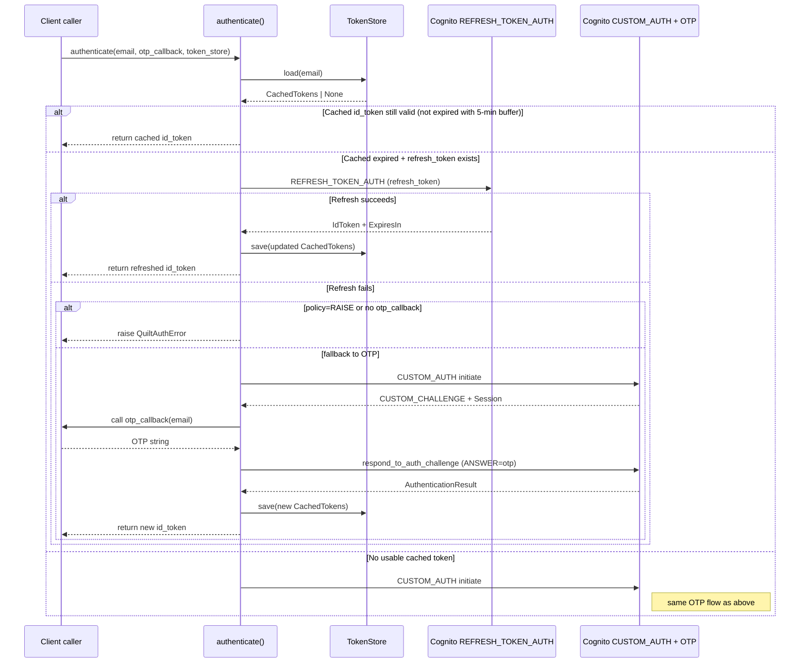

# Authentication and token lifecycle

This page explains the authentication design: why Cognito was chosen, how tokens work, and why the resolution order is the way it is. For practical steps, see [Authenticate and manage tokens](../how-to/authenticate.md).

---

## Why Cognito and the custom-auth OTP flow

Quilt uses AWS Cognito with a custom authentication challenge rather than API keys. The reasons for this are:

- **No secret management for end users.** API keys require users to generate, store, and rotate long-lived secrets. Cognito OTP is simpler: a user authenticates with their email and a one-time code, and the result is a short-lived JWT.
- **Consistent with the mobile apps.** Quilt's iOS and Android applications authenticate using the same Cognito pool. The library uses the same flow, so it speaks the same authentication protocol as the official apps. That is the most tested and stable path.
- **The OTP is email-based.** There is no phone number, TOTP app, or hardware key, so initial setup stays simple.

The custom-auth challenge flow works in two steps:
1. `initiate_auth(AuthFlow="CUSTOM_AUTH")`: Cognito sends an OTP to the user's email and returns a `Session` token.
2. `respond_to_auth_challenge(ANSWER=otp)`: The client submits the OTP and receives an `AuthenticationResult` containing the `IdToken`, `RefreshToken`, and `ExpiresIn`.

---

## What a Cognito IdToken is

The `IdToken` returned by Cognito is a signed JWT (JSON Web Token). It contains:
- The user's identity claims (email, Cognito user ID).
- An `exp` field (expiry timestamp).

The library uses the `IdToken` as the `authorization` header value on every gRPC call. The Quilt API validates this token on each request and does not issue its own tokens.

Cognito IdTokens are valid for approximately one hour (`ExpiresIn` is typically `3600` seconds). After expiry, the token is rejected by the API with `UNAUTHENTICATED`.

---

## The three-tier token resolution

`authenticate()` in `auth.py` implements a three-step resolution:

**Step 1: Check the cache.** If a `TokenStore` is provided and the stored `IdToken` is not expired (with a 5-minute buffer), return it immediately. No network call is needed. This is the fast path for every request after initial login.

**Step 2: Try the refresh token.** If the cached `IdToken` is expired but a `RefreshToken` is present, attempt a `REFRESH_TOKEN_AUTH` exchange. If it succeeds, store and return the new `IdToken`. This is the silent renewal path, so no user interaction is required.

**Step 3: Full OTP flow.** If there is no usable cached or refreshed token, prompt for an OTP. This path requires user interaction and should only happen on first use or after the refresh token expires.

The order is designed to minimise user friction. Users should almost never see the OTP prompt after initial setup.

---

## The 5-minute expiry buffer

`CachedTokens.is_expired` returns `True` when `time.time() > expires_at - 300`. This means the library treats a token as expired 5 minutes before Cognito would.

The reason is race conditions. A token that is valid at the start of a `set_space()` call might expire before the gRPC request completes. With a 5-minute buffer, any token the cache accepts as "not expired" will remain valid long enough to complete typical API calls. The trade-off is at most 5 minutes of effective lifetime per token, which is negligible given that Cognito IdTokens last one hour.

---

## Why the refresh token is not rotated

When `REFRESH_TOKEN_AUTH` succeeds, Cognito returns a new `IdToken` but does not issue a new `RefreshToken`. The existing refresh token continues to work. The library preserves the existing refresh token in the updated `CachedTokens`.

This is Cognito's default behaviour for the refresh flow. Rotation (issuing a new refresh token on each use) is a separate Cognito feature that Quilt's pool does not appear to use. The implication is that a `RefreshToken` has a long but finite validity period (typically weeks to months). When the refresh token eventually expires, the user must complete the OTP flow again.

---

## Why the transport interceptor handles `UNAUTHENTICATED` differently from the stream

The `_AuthInterceptor` handles `UNAUTHENTICATED` on **unary RPCs** by refreshing the token and retrying the call exactly once. This works because unary calls are stateless, so the retry sends a fresh independent request.

The `NotifierStream` handles `UNAUTHENTICATED` on the **bidirectional stream** by disconnecting, refreshing the token, waiting for the back-off delay, and then reconnecting. It cannot retry in place because the stream is stateful: the gRPC stream object that received `UNAUTHENTICATED` is dead. A new stream must be opened with fresh metadata.

This asymmetry is why the interceptor does not apply retry logic to streaming RPCs. `intercept_stream_stream` only injects metadata; it does not retry. The stream's reconnect loop (in `NotifierStream`) is what handles auth recovery for the streaming case.
