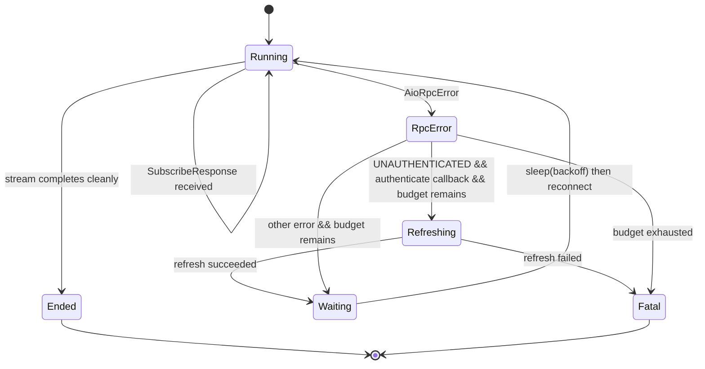

# The streaming protocol

This page explains why the streaming protocol is designed the way it is. For how-to guidance on using the stream, see [Stream real-time updates](../how-to/stream-updates.md).

---

## Why a bidirectional stream instead of polling or webhooks

The Quilt cloud uses `NotifierService.Subscribe`, a single bidirectional gRPC stream, to push real-time change events to clients. This choice over polling or webhooks reflects specific constraints:

**Why not polling?** Polling requires the client to decide on a frequency. Too slow: the client misses fast state changes (a temperature spike that triggered the system to act). Too fast: unnecessary traffic and server load. A well-tuned poll interval still introduces latency equal to the poll period. The stream delivers events within milliseconds of the state change.

**Why not webhooks?** Webhooks require the client to expose an HTTP endpoint. This adds significant operational burden: TLS termination, authentication, and a public IP or NAT traversal. A mobile app or embedded device cannot accept inbound connections at all. The gRPC stream is client-initiated: the client opens a connection to the server, not the other way around.

**Why bidirectional?** The server pushes events; the client sends subscription management messages (add/remove topics). Both happen on the same connection, which eliminates a separate subscription control RPC and simplifies the connection lifecycle.

---

## The topic model and why it's hierarchical

Topics follow the pattern `hds/<entity_type>/<entity_id>`. For example:

- `hds/space/98f9121d-aaaa-bbbb-cccc-123456789abc`
- `hds/indoor_unit/deadbeef-...`
- `hds/outdoor_unit/...`

The hierarchy is `hds` (Home Datastore) → entity type → entity ID. This design has two properties:

1. **Granular subscriptions.** A client can subscribe to exactly the entities it cares about, such as a single room, without receiving updates for unrelated entities.
2. **No server-side fan-out logic.** The server publishes events at the entity level. The subscription model is a simple set of topics. The server does not need to know what "living room + bedroom" means. It just delivers events for the requested IDs.

In practice, most clients subscribe to all topics for their system using `snapshot.stream_topics()`. The topic model exists to support future use cases where a client might subscribe to a subset.

---

## The wire format parsing challenge

The `NotifierEvent.topic` field carries binary data, not a plain string. The payload is a nested protobuf envelope, not a `google.protobuf.Any` message that Python's protobuf library can decode directly.

`NotifierStream._parse_event()` walks this structure manually:

1. If `evt.topic == b""`, the event is a heartbeat. Ignore it.
2. Parse `evt.topic` as a length-delimited protobuf message. Field 1 is the topic string (e.g., `"hds/space/..."`) and field 2 is the notification payload.
3. From field 2, extract nested field 2 (`HdsNotification` bytes).
4. From `HdsNotification`, extract field 2 (`HomeDatastoreObjectDiff` bytes).
5. From `HomeDatastoreObjectDiff`, extract the entity by field number (field 3 = Space, field 9 = IndoorUnit, etc.).

The reason for this manual walk is that `google.protobuf.Any` requires the full type URL (`type.googleapis.com/...`) to decode, and the server uses a custom nesting structure rather than the standard `Any` wrapper. This is a trade-off in the Quilt API design. It is not a deficiency in the library.

---

## Why sparse diffs

Stream notifications carry only the fields that changed. Each notification is a "sparse diff." A temperature update for a space will carry the new `state.ambient_temperature_c` but will not include `controls.hvac_mode` or `settings.name` because those did not change.

In proto3, absent fields deserialise to their default values: zero for numerics, empty string for strings, `None` for optional sub-messages, and enum `0` (which is `UNSPECIFIED` for most Quilt enums) for enum fields.

The server sends sparse diffs rather than full entity snapshots for efficiency: most state changes affect a single sub-field. Sending the full entity on every change would inflate traffic significantly for high-frequency sensors (temperature, humidity, radar presence) that update every few seconds.

For a discussion of how to merge sparse diffs correctly, see [Snapshot and stream data model](snapshot-and-stream.md).

---

## The reconnect state machine

When the stream connection drops for any reason, `NotifierStream` enters a reconnect loop. The state machine is:

The back-off starts at `reconnect_delay_s` (default 1 second), doubles on each failed attempt, and caps at 60 seconds. The request queue is reset before each reconnect so the server receives a fresh subscription request with the full topic list.

The `UNAUTHENTICATED` path is special: the stream refreshes the token before waiting, because reconnecting immediately with a stale token would fail again. If the refresh itself fails, the stream gives up rather than entering an infinite retry loop with an invalid token.

The `max_reconnects` budget controls how many times the loop can iterate. `-1` means unlimited. When the budget is exhausted, a `QuiltStreamError` is stored in `stream.error` and error callbacks are invoked.

---

## Why callbacks swallow exceptions

Exceptions raised inside stream callbacks are caught, logged with `logger.exception(...)`, and swallowed. They do not stop the stream.

This is the correct behaviour for a persistent integration. A callback processes one event. If that event triggers a bug in the callback (for example, a `KeyError` when looking up a room by ID), the correct response is to log the error and continue processing subsequent events, not to crash the entire integration.

The implication is that callback code must be defensive. Do not assume that a stream space has a temperature reading (`ambient_temperature_c` may be `None`). Do not assume that every space ID in the snapshot is still present after reconnects. Check for `None` and missing keys, and use the snapshot's `apply_*` methods to merge before accessing sub-fields.

Fatal stream errors (budget exhausted) are not swallowed. They are stored in `stream.error` and delivered to `on_error` callbacks, or re-raised from the stream's internal task if no error callbacks are registered.
