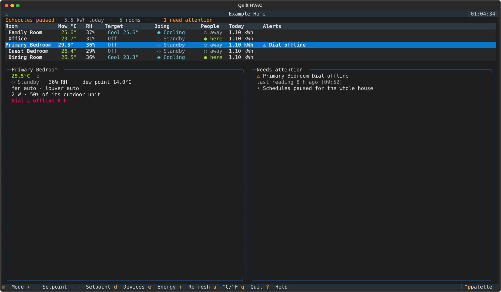
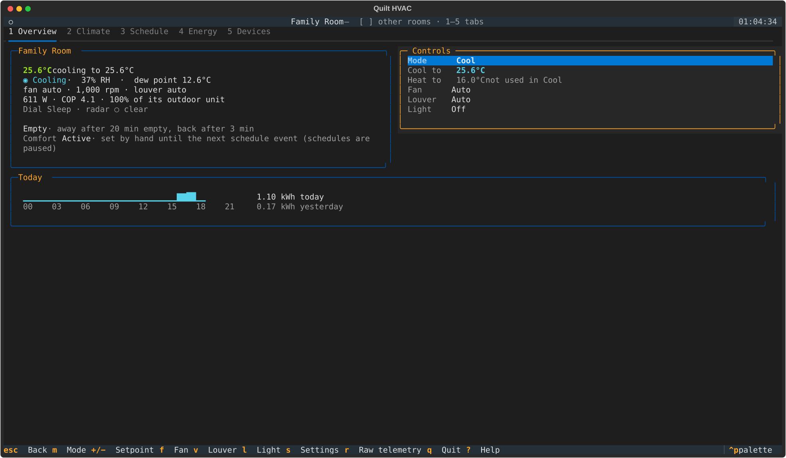
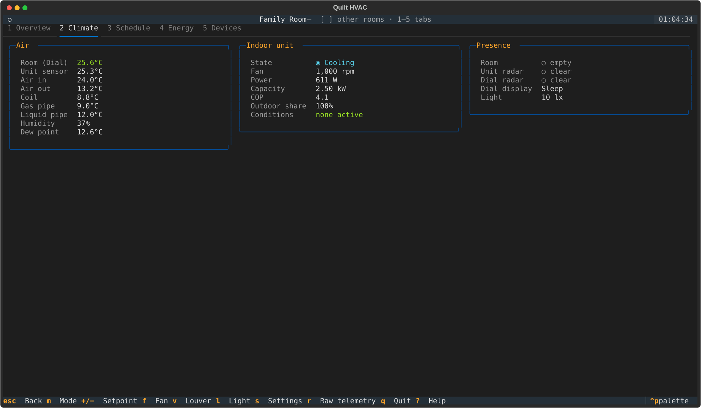
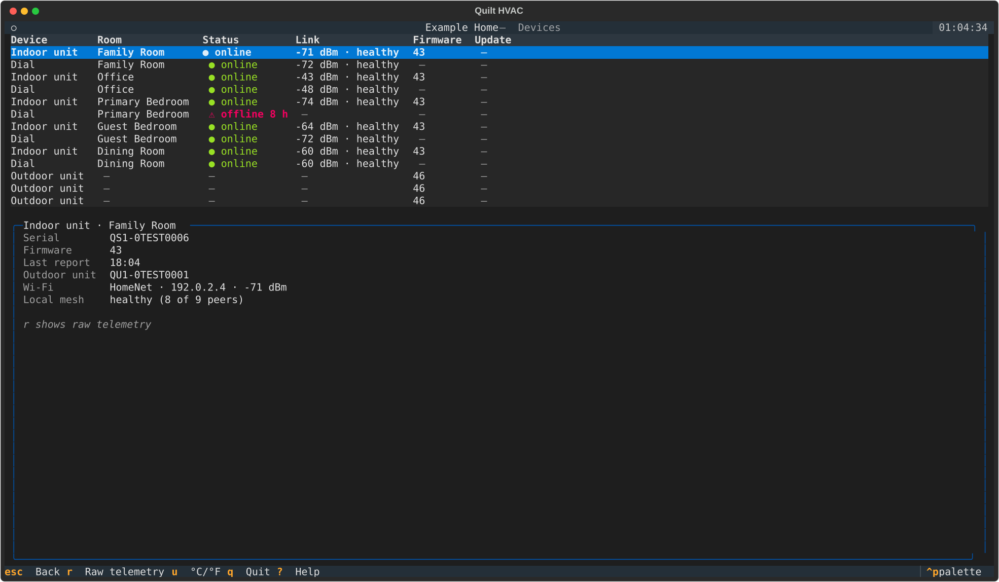
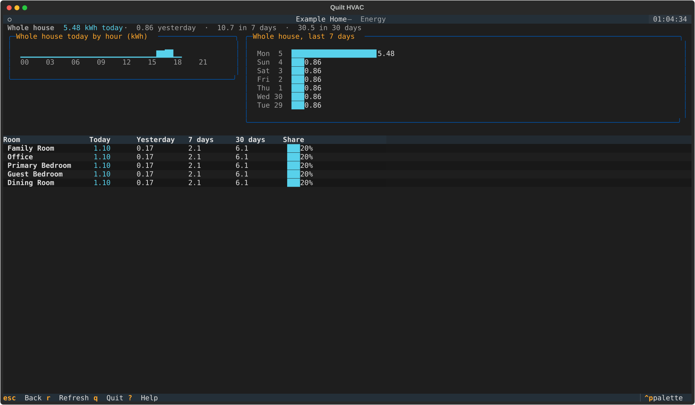

# Use the terminal UI

`quilt tui` is a full-screen app for watching and controlling your system from a terminal. It
updates live from the notifier stream and works in a terminal as small as 100×30.

```bash
pip install "quilt-hp-python[cli]"
quilt login --email you@example.com   # once; tokens are cached
quilt tui
```

Press `?` on any screen for every key. The screenshots below come from the project's render
tests, so they match what the app draws; the system in them is a real one with its names and
identifiers replaced.

---

## Home



Every room in one table: temperature and humidity, what it's set to, what it's doing,
whether anyone is there, and today's energy. The panel on the left summarises the selected
room. **Needs attention** lists anything you should know about: offline devices (with when
they last reported), faults, tests in progress, firmware updates and paused schedules.

| Key | Action |
|-----|--------|
| `↑` `↓` | Choose a room |
| `enter` | Open the room |
| `m` | Next mode for the selected room |
| `+` `−` | Raise or lower the setpoint the mode uses (in Auto, the one nearer the room temperature) |
| `d` | Devices |
| `e` | Energy |
| `P` | Pause or resume schedules for the whole house (asks first) |
| `r` | Refresh |

Quick presses build on each other: two `+` presses from 24 °C send 24.5 °C and then 25 °C.

---

## Room



Five tabs, switched with `1`–`5`. `[` and `]` move to the previous or next room and stay on
the same tab; `esc` goes back to Home.

- **Overview** — the room's state, occupancy and auto-away timing, the comfort setting in
  effect and how it was set, and the **controls list**: `↑` `↓` choose a control, `←` `→`
  change it, `enter` types a setpoint. A setpoint the current mode doesn't use is dimmed.
- **Climate** — every temperature source by name (the Dial, the unit's own sensor, air in
  and out, coil and refrigerant pipes), humidity and dew point; the indoor unit's power,
  capacity, efficiency and any active conditions; presence from each radar.
- **Schedule** — the week at a glance (view only).
- **Energy** — today, yesterday, 7 and 30 days, today by hour, and the last 14 days.
- **Devices** — the room's indoor unit, Dial and outdoor unit with their details.



| Key | Action |
|-----|--------|
| `m` | Next mode |
| `+` `−` | Raise or lower the setpoint the mode uses |
| `f` | Next fan speed |
| `v` | Next louver mode |
| `l` | Light on or off |
| `s` | Room settings: auto-away timing, Away temperatures, presence-sensor range and height, default light brightness |
| `r` | Show raw telemetry (Climate and Devices tabs) |

---

## Devices



Every indoor unit, Dial, remote sensor and outdoor unit, grouped by room, with online status,
Wi-Fi signal, mesh health, firmware and update progress. An offline device shows how long ago
it last reported instead of stale readings. The selected device's details are shown below;
`r` adds its raw telemetry.

---

## Energy



The whole house today by hour and over the last week, and each room's use today, yesterday,
over 7 and 30 days, and its share of the house's 30-day total.

---

## Everywhere

| Key | Action |
|-----|--------|
| `?` | Every key for every screen |
| `u` | Switch between °C and °F (remembered) |
| `ctrl+p` | Command palette, including the theme (remembered) |
| `q` | Quit |
