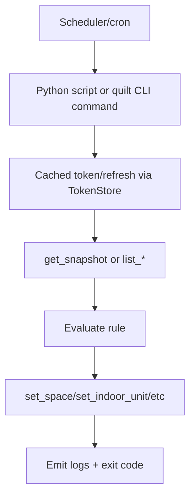

# CLI automation scripts playbook

## Typical flow

## Playbook

1. Prefer Python API for complex logic; use CLI for simple one-shot operations.
2. Always run commands/scripts with explicit account/home context (`--email`, `--home`, or constructor args).
3. Treat command output as contract: use `--output json` where available for machine parsing.
4. Keep scripts idempotent (compare desired vs current before issuing updates).
5. Handle `QuiltAuthError` and non-zero CLI exits with retry/backoff policy appropriate for your scheduler.
