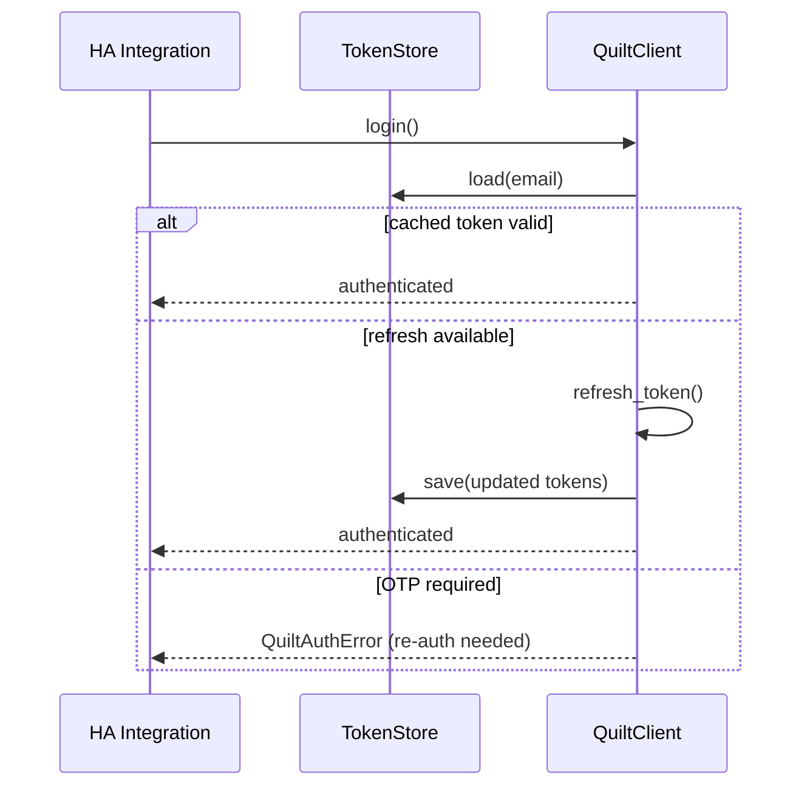

# Home Assistant integration playbook

## Recommended architecture

Use Home Assistant's coordinator pattern with one authenticated `QuiltClient` per config entry.

```mermaid
flowchart TD
    HA[HA Config Entry] --> COORD[DataUpdateCoordinator]
    COORD --> QC[QuiltClient]
    QC --> SNAP[get_snapshot\n(list/read path)]
    QC --> STREAM[NotifierStream\n(optional push updates)]
    COORD --> CLIMATE[Climate entities per room Space]
    COORD --> SENSOR[Sensors\nenergy, telemetry, online state]
    COORD --> NUMBER[Number/select/switch entities\nsetpoints, fan, louver, execution]
```

### Entity mapping (implemented-model aligned)

| HA entity | Quilt model / API | Notes |
| --- | --- | --- |
| `climate` per room | `Space` (`snapshot.rooms`), `set_space()` | Primary control surface: mode + dual setpoints. |
| Room config entities | `SpaceSettings`, `set_space_settings()` | Occupancy timeout tuning. |
| Fan/select/light-like controls | `IndoorUnit`, `set_indoor_unit()` | Fan speed, louver mode/position, LED properties. |
| Preset/select entities | `ComfortSetting`, `update_comfort_setting()` | Use when exposing named comfort presets. |
| Schedule entities | `ScheduleDay`/`ScheduleWeek` APIs | Create/update/delete day/week. |
| Binary sensor/switch | `Location.schedule_paused`, `set_schedule_execution()` | Global schedule execution control. |
| Energy sensors | `get_energy()` (`SpaceEnergyMetrics`) | Periodic pull; aggregate with HA statistics. |

## Auth and token persistence in HA

1. Implement HA-backed `TokenStore` (or `LegacyTokenStore`) for secure persistence.
2. Store refresh/id tokens in HA `.storage` or config-entry managed storage with restricted access.
3. Keep non-secret options (home filter, polling interval, enable stream) in `ConfigEntry.options`, not in token storage.
4. Initialize client as `QuiltClient(email, home=..., token_store=...)`.
5. Trigger OTP only from config flow/re-auth flow when `login()` cannot satisfy cached/refresh auth.



## Polling vs streaming strategy

Recommended default for HA: **hybrid**.

- **Polling baseline:** `get_snapshot()` on coordinator interval for full consistency.
- **Streaming acceleration:** `client.stream(snapshot.stream_topics())` for low-latency updates.
- Apply stream diffs into an in-memory snapshot via `SystemSnapshot.apply_*` helpers before notifying entities.
- If stream fails, keep polling active; stream is additive, not required for correctness.

## Reliability, backoff, and error handling

- Treat `QuiltAuthError` as re-auth required; surface HA Repairs/config entry reauth.
- For transient `QuiltError`/gRPC faults, keep last good coordinator data and retry next interval.
- For streaming, use built-in reconnect (`max_reconnects`, `reconnect_delay_s`, exponential backoff capped at 60s).
- Register `stream.on_error(...)` to mark stream unhealthy and fall back to polling-only mode.
- Avoid service hammering: clamp minimum poll interval and jitter coordinator refreshes.

## Configuration/options guidance

Recommended `ConfigEntry.options`:

- `home` (optional system-name substring filter)
- `poll_interval_s` (e.g., 30-120s)
- `enable_stream` (default true)
- `max_reconnects` (default `-1` unlimited)
- `reconnect_delay_s` (default `1.0`)
- `snapshot_ttl_s` (usually `0` for HA coordinator-driven freshness)

Operational guidance:

- Use one `QuiltClient` per entry; avoid per-entity clients.
- Expose diagnostics from safe metadata (system id/name, stream status, last refresh), never tokens.
