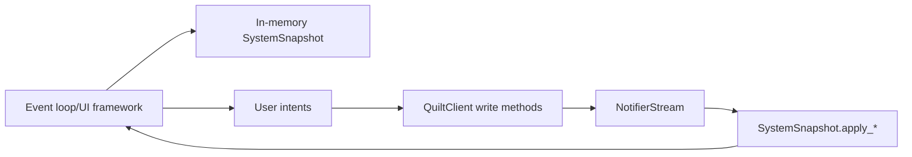

# TUI and event-driven app playbook

## Architecture pattern

## Playbook

1. Hydrate initial state with `get_snapshot()` before rendering.
2. Register stream callbacks (`on_space_update`, `on_indoor_unit_update`, etc.) and merge sparse diffs into local snapshot.
3. Re-render from normalized snapshot state, not raw event payloads.
4. Use `on_error(...)` to surface stream health and trigger fallback refresh.
5. Support periodic full refresh to heal missed events/network partitions.

## Interaction and resilience

- Debounce rapid user actions that map to repeated writes.
- Preserve responsive UI by dispatching network I/O in background tasks.
- Expose connection/auth status clearly (connected, reconnecting, re-auth required).
