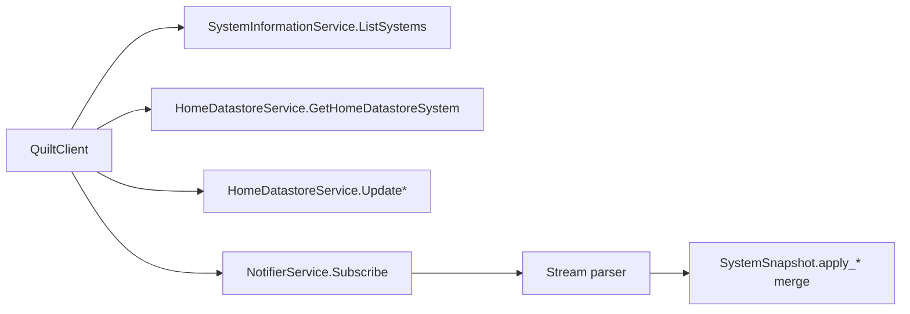

# gRPC services and method matrix

This matrix summarizes the known Quilt service surface and what this Python
client currently wraps.

## Service/method matrix

| Service | Method(s) | Status in `quilt-hp-python` | Notes |
| --- | --- | --- | --- |
| `HomeDatastoreService` | `GetHomeDatastoreSystem` | Implemented (`HomeDatastoreService.get_system`) | Primary snapshot read path. |
| `HomeDatastoreService` | `UpdateSpace`, `UpdateIndoorUnit`, `UpdateComfortSetting`, schedule day/week create/update/delete, `UpdateLocation` | Implemented | Used by `QuiltClient` convenience APIs. |
| `HomeDatastoreService` | Remaining CRUD/list/get methods (`GetSpace`, `CreateSpace`, `DeleteSpace`, remote sensor CRUD, additional schedule/comfort/location methods, etc.) | Schema-defined, not wrapped | Available in protobufs; call directly from generated stubs if needed. |
| `SystemInformationService` | `ListSystems`, `GetEnergyMetrics` | Implemented | Used for system discovery and energy queries. |
| `SystemInformationService` | `SetAddress` | Schema-defined, not wrapped | Not exposed by `SystemInformationService` wrapper. |
| `UserService` | `GetLoggedInUser`, `UpdateLoggedInUser`, `GetUserAttributes`, `PatchUserAttributes` | Implemented | Exposed by `UserService` and `QuiltClient` user-profile wrappers. |
| `NotifierService` | `Subscribe` (bidirectional stream) | Implemented (`NotifierStream`) | Stream parsing and reconnect logic included. |
| `InvitationService` | All methods | Schema-defined, not wrapped | Present in service protobuf. |
| `PartnerService` | All methods | Schema-defined, not wrapped | Present in service protobuf. |
| `SystemUserService` | All methods | Schema-defined, not wrapped | Present in service protobuf. |
| `MobileAppService` | `AuthorizeNewDevice` | Schema-defined, not wrapped | Present in service protobuf. |
| `SystemService` (`core.protos.system`) | `GetSystem`, `CreateSystem`, `UpdateSystem`, `DeleteSystem`, `ListSystems` | Schema-defined, not wrapped | Separate service family in cleaned protos. |
| `quilt.pairing.v1` payloads | BLE/Wi-Fi pairing messages | Schema-defined only | Message contracts, not a wrapped gRPC service in this package. |

## Practical call flow implemented in this package

## Notes for alternate clients

- The protobuf surface is broader than the wrapper surface in this package.
- For methods marked "Schema-defined, not wrapped", use generated stubs directly
  and follow the transport/auth guidance from this documentation.
- Streaming support in this package is focused on `NotifierService.Subscribe`.
