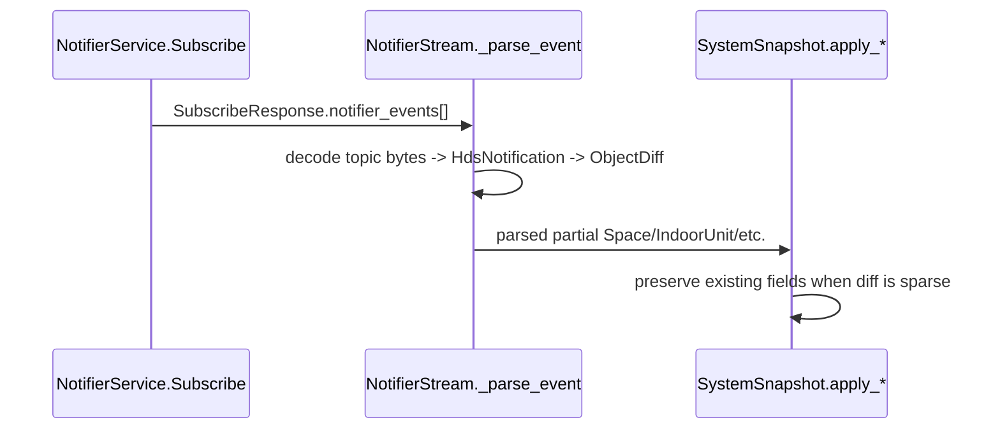

# HDS entities and field semantics

Focus: entities most relevant for implementing another client stack (snapshot + mutations + stream diffs).

## Snapshot entity map (core relationships)

```mermaid
flowchart TD
    SYS[HomeDatastoreSystem]
    SYS --> SP[Space]
    SYS --> IU[IndoorUnit]
    SYS --> OU[OutdoorUnit]
    SYS --> CT[Controller]
    SYS --> QSM[QuiltSmartModule]
    SYS --> CS[ComfortSetting]
    SYS --> SD[ScheduleDay]
    SYS --> SW[ScheduleWeek]
    SYS --> LOC[Location]
    SYS --> RS[RemoteSensor]
    SYS --> CRS[ControllerRemoteSensor]
    SYS --> SUI[SoftwareUpdateInfo]

    SP -->|controls.comfort_setting_id| CS
    SD -->|events[].comfort_setting_id| CS
    SW -->|days[].day_id| SD
    IU -->|relationships.space_id| SP
    CT -->|relationships.space_id| SP
    OU -->|relationships.space_id| SP
    IU -->|relationships.quilt_smart_module_id| QSM
```

## Core entities (practical semantics)

### `Space` (room/zone)

- Identity: `header.object_id`, `header.system_id`.
- Room-vs-root: this library treats `parent_space_id` present/non-empty as a room (`is_room`).
- Controls update behavior (implemented):
  - always sends both heat/cool setpoints;
  - `temperature_setpoint_c` is mode-routed;
  - in `STANDBY`, clears comfort-setting association to force true off.
- Settings update behavior (implemented): echoes existing `name/timezone/...` when patching timeouts to avoid server-side clearing from sparse diffs.

### `IndoorUnit`

- Core write surface used here: `controls` (fan/louver/LED) + `settings` (presence fence, radar height, default brightness).
- State has online-staleness semantics in this package (`updated_ts` threshold ~5 min).
- Includes optional diagnostic/performance submessages (`hvac_inputs`, `conditions`, `performance_data`, `performance_metrics`, `presence`, `occupancy`).

### `ComfortSetting`

- Per-space preset: mode + dual setpoints + fan speed (+ optional louver fields).
- Used directly by `UpdateComfortSetting` and indirectly by `Space.controls.comfort_setting_id`.
- `ComfortSettingType` drives away/off interpretation in this package.

### `ScheduleDay` and `ScheduleWeek`

- `ScheduleDay.events[]` carries time-of-day (`start_s`) and target comfort/mode/setpoints.
- `ScheduleWeek.days[]` maps weekday → `ScheduleDay` id.
- Implemented write methods: create/update/delete day/week (no list/get wrappers).

### `Location`

- Used in this package for global schedule execution pause/resume only (`SCHEDULE_EXECUTION_PAUSED` vs `RUNNING`).
- Full location CRUD exists in schema but is not wrapped.

### `Controller`, `QuiltSmartModule`, `RemoteSensor`, `ControllerRemoteSensor`, `SoftwareUpdateInfo`

- Parsed and surfaced from snapshots/streams.
- No dedicated mutation wrappers in this package except location/space/indoor/schedule/comfort surfaces.
- Useful for alternate clients needing richer telemetry, remote sensor control mode, and update status linkage IDs.

## Stream diff model (critical for alternate clients)

Notifier events are sparse partial protobufs. This package:

1. parses nested binary payloads from `NotifierEvent.topic`;
2. decodes `HomeDatastoreObjectDiff` entity payloads by HDS field number;
3. merges partial updates into an existing snapshot to avoid wiping absent sub-messages.



## Known unknowns / explicit non-claims

- Do **not** assume all schema RPCs are supported by this Python package; only methods listed as implemented in [gRPC services and method matrix](grpc-services-matrix.md) are wrapped.
- `proto/cleaned/quilt_system.proto` explicitly marks some methods as KMP-only/not confirmed in current Android APK.
- Several fields in cleaned protos are marked unconfirmed or inferred in comments; validate these against your own captures before depending on them in production clients.
