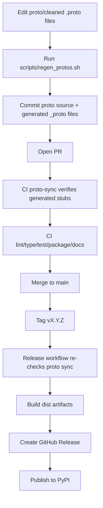

# Protobuf artifacts and regeneration workflow

## Source and generated locations

- Proto sources: `proto/cleaned/*.proto`
- Generated package: `src/quilt_hp/_proto/`

Generated files include:

- `*_pb2.py`
- `*_pb2_grpc.py`
- `*_pb2.pyi`

Current generated modules:

- `quilt_hds`
- `quilt_services`
- `quilt_notifier`
- `quilt_system`
- `quilt_device_pairing`

## Regeneration workflow

Use the checked-in script:

```bash
./scripts/regen_protos.sh
```

The script:

1. runs `grpc_tools.protoc` against `proto/cleaned`
2. writes generated output to `src/quilt_hp/_proto`
3. rewrites generated absolute imports to relative imports for package-local use
4. ensures `_proto/__init__.py` exists

## When to regenerate

Regenerate whenever `proto/cleaned` changes.

After regeneration, run repository checks before committing (lint/type/test/build) to ensure generated artifacts remain compatible with the package.

## Is protobuf generation automated?

Generation itself is still a maintainer action, and that is intentional.

- Maintainers regenerate stubs in a normal code change (PR), commit them, and
  review the diff.
- CI (`proto-sync` job) re-runs `./scripts/regen_protos.sh` and fails if
  checked-in stubs are stale (`git diff --exit-code src/quilt_hp/_proto`).
- Release workflow repeats this check before creating/publishing artifacts.

This means packaging/publishing never silently changes protobuf outputs.
Published artifacts always come from committed, reviewable generated files.

## Full release flow (proto + package)


