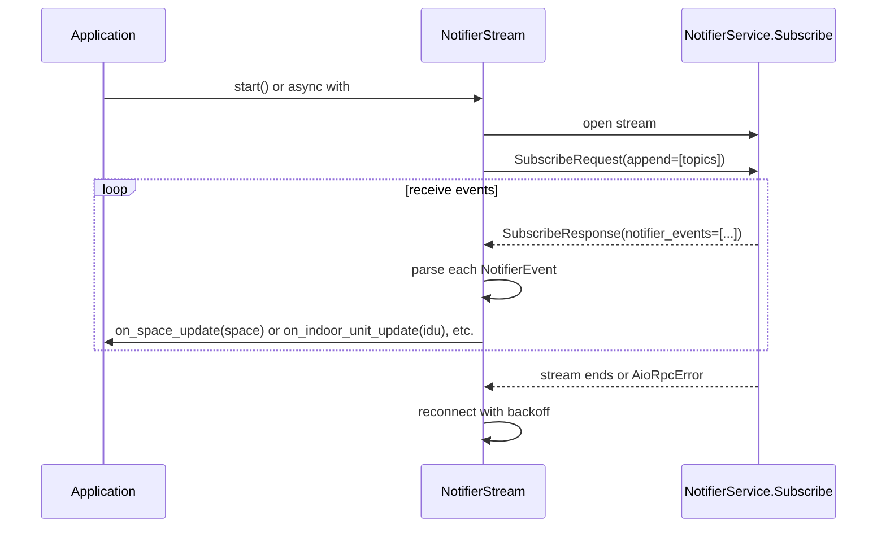
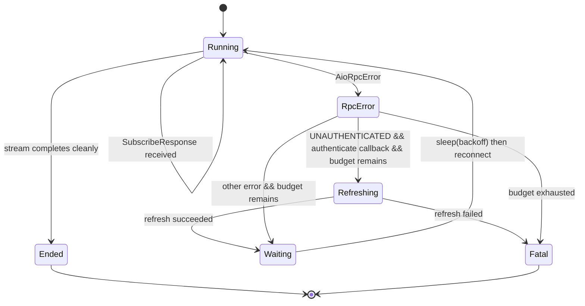

# Streaming protocol behavior

The `NotifierService.Subscribe` bidirectional gRPC stream is how the Quilt cloud pushes real-time change notifications to clients. This page explains the wire format, topic model, reconnect behavior, and how to use `NotifierStream` in your code.

## The bidirectional stream

`NotifierService` exposes a single RPC: `Subscribe(stream SubscribeRequest) returns (stream SubscribeResponse)`. Both sides stream. The client sends subscription management messages; the server sends change notifications.

The client sends `SubscribeRequest` messages, each of which contains a `oneof`:
- `append` — add a list of topics to the subscription.
- `remove` — remove a list of topics.

The server sends `SubscribeResponse` messages containing three repeated fields:
- `notifier_events` — the actual change notifications.
- `control_events` — subscription management acknowledgements (topic added/removed, permission denied, etc.).
- `system_events` — system-level events (e.g. software update notifications).

## Topic format

Topics follow the pattern `hds/<entity_type>/<entity_id>`. For example:
- `hds/space/98f9121d-aaaa-bbbb-cccc-123456789abc`
- `hds/indoor_unit/deadbeef-...`
- `hds/outdoor_unit/...`
- `hds/controller/...`
- `hds/quilt_smart_module/...`
- `hds/remote_sensor/...`
- `hds/controller_remote_sensor/...`
- `hds/software_update_info/...`

`SystemSnapshot.stream_topics()` generates the complete list for a loaded snapshot:

```python
snapshot = await client.get_snapshot()
topics = snapshot.stream_topics()
stream = client.stream(topics)
```

Additional topic families exist in the protocol (e.g. `hds/schedule_week/...`, `hds/comfort_setting/...`) but the library does not currently map them to typed callbacks.

## How `NotifierStream` manages the stream

`NotifierStream` is not a simple stub call — it manages the full bidirectional stream lifecycle. The client side uses an `AsyncIterator` that first yields an initial `SubscribeRequest(append=topics)`, then drains a queue of subsequent add/remove requests while the stream is live. The queue reader has a 30-second timeout to keep the async generator alive without sending unnecessary messages; the underlying TCP connection is kept open by the gRPC keepalive options.



## Wire format parsing

The `NotifierEvent.topic` field carries binary data, not a plain string. The actual payload is a nested protobuf envelope (not a `google.protobuf.Any` that Python can directly decode). `NotifierStream._parse_event()` walks this structure manually:

1. If `evt.topic == b""`, the event is a heartbeat. Return `None`.
2. Parse `evt.topic` as a length-delimited protobuf message. Field 1 is the topic string bytes (UTF-8 decoded to give e.g. `"hds/space/..."`) and field 2 is the notification payload.
3. From field 2, extract nested field 2 (`HdsNotification` bytes).
4. From `HdsNotification`, extract field 2 (`HomeDatastoreObjectDiff` bytes).
5. From `HomeDatastoreObjectDiff`, extract individual entity fields by field number:
   - Field 3 → Space
   - Field 6 → OutdoorUnit
   - Field 7 → QuiltSmartModule
   - Field 9 → IndoorUnit
   - Field 11 → Controller
   - Field 12 → RemoteSensor
   - Field 16 → ControllerRemoteSensor
   - Field 18 → SoftwareUpdateInfo

Each extracted bytes blob is parsed with the corresponding proto class's `ParseFromString()` and then converted to the Python domain model via `from_proto()`.

## Sparse diffs

Stream notifications carry only the fields that changed — a "sparse diff". A space update triggered by a temperature sensor reading will carry a `state` sub-message but will have `controls.hvac_mode == UNSPECIFIED` and `settings.name == ""` because those fields were absent from the wire diff (proto3 defaults).

This is why you should always merge stream updates into your snapshot using `snapshot.apply_space(space)` rather than using the raw stream space directly:

```python
snapshot = await client.get_snapshot()

def on_space(space: Space) -> None:
    merged = snapshot.apply_space(space)
    # merged preserves hvac_mode, setpoints, settings, etc. from snapshot
    # while updating only the fields that actually changed
    print(f"{merged.name}: {merged.state.ambient_temperature_c:.1f}°C")

stream = client.stream(snapshot.stream_topics())
stream.on_space_update(on_space)
await stream.run_forever()
```

## Reconnect and exponential back-off

When the stream connection drops (for any reason), `NotifierStream` attempts to reconnect automatically. The back-off starts at `reconnect_delay_s` (default 1 second), doubles on each failed attempt, and caps at 60 seconds. The request queue is reset before each reconnect so the server receives a fresh subscription request.



The `max_reconnects` parameter controls the budget. `-1` (the default) means unlimited reconnects. `0` means no retries after the first failure. When the budget is exhausted, a `QuiltStreamError` is stored in `stream.error` and error callbacks are invoked.

On `UNAUTHENTICATED`, the stream invokes the `authenticate` callback (which calls `client.refresh_token()`) before waiting and reconnecting. If the refresh itself fails, the stream gives up immediately rather than continuing to retry with an invalid token.

## Using `NotifierStream`

### As a background task (recommended for integrations)

```python
async with QuiltClient("you@example.com", token_store=store) as client:
    await client.login()
    snapshot = await client.get_snapshot()

    async with client.stream(snapshot.stream_topics()) as stream:
        stream.on_space_update(lambda s: print(f"{s.name}: {s.state.ambient_temperature_c}°C"))
        stream.on_error(lambda e: print(f"Stream error: {e}"))
        # Do other work here — the stream runs in a background task.
        await asyncio.sleep(3600)
```

### Blocking (for scripts and CLI tools)

```python
stream = client.stream(snapshot.stream_topics())
stream.on_space_update(handle_space_update)
stream.on_indoor_unit_update(handle_idu_update)
await stream.run_forever()  # blocks until cancelled or fatal error
```

### Dynamic subscription management

After the stream is running you can subscribe to additional topics or unsubscribe from existing ones:

```python
await stream.subscribe(["hds/space/new-room-uuid"])
await stream.unsubscribe(["hds/space/old-room-uuid"])
```

## Callback error handling

Exceptions raised inside callbacks are caught, logged with `logger.exception(...)`, and swallowed — they do not stop the stream. This prevents a buggy callback from taking down an otherwise healthy stream. Callbacks should be robust to partial data (sparse diffs) and should not raise on missing fields.

Fatal stream errors (when reconnect budget is exhausted) are stored in `stream.error`. If `on_error` callbacks are registered they are invoked with the exception; if no error callbacks are registered the exception is re-raised from the stream's task, which will surface as an unhandled task exception.
