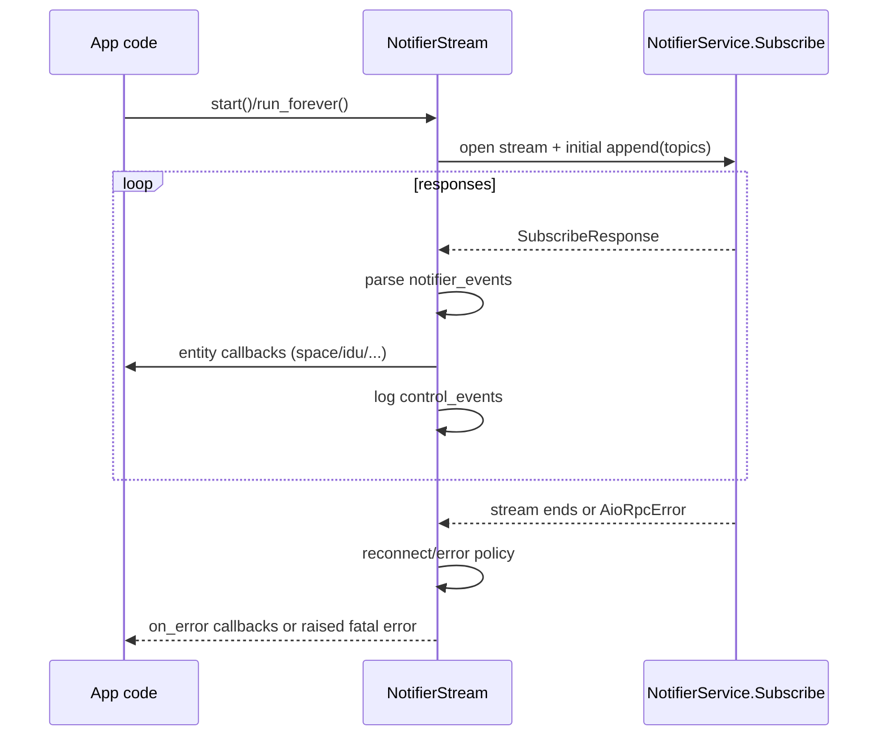
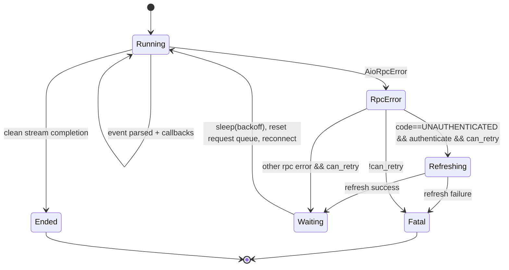

# Streaming protocol behavior

Deep protocol notes for alternate-client implementers targeting `NotifierService.Subscribe`.

## Topic model and subscription semantics

- Client sends a bidirectional `Subscribe(stream SubscribeRequest)` stream.
- `SubscribeRequest` uses a `oneof`:
  - `append` adds topic subscriptions.
  - `remove` removes topic subscriptions.
- This library sends:
  - one initial `append` containing all startup topics,
  - later `append` on `NotifierStream.subscribe(...)`,
  - later `remove` on `NotifierStream.unsubscribe(...)`.
- Topic shape used by this project is `hds/<entity_type>/<entity_id>`.
- `SystemSnapshot.stream_topics()` currently emits:
  - `hds/space/<id>`
  - `hds/indoor_unit/<id>`
  - `hds/outdoor_unit/<id>`
  - `hds/controller/<id>`
  - `hds/quilt_smart_module/<id>`
  - `hds/remote_sensor/<id>`
  - `hds/controller_remote_sensor/<id>`
  - `hds/software_update_info/<id>`
- Additional entity topic families exist in cleaned proto comments but are not converted to model callbacks by this library.

## Wire parsing model (nested notifier payload extraction)

`NotifierStream._parse_event(...)` parses **raw bytes**, not generated typed wrappers, because `NotifierEvent.topic` is encoded as opaque bytes in live captures.

Parsing steps:

1. `evt.topic == b""` => heartbeat; ignored (`None` return).
2. Parse `evt.topic` as a len-delimited protobuf envelope:
   - field `1` => topic/type string bytes (decoded UTF-8 when possible),
   - field `2` => nested bytes.
3. From field `2`, extract nested field `2` again (`inner_notif`).
4. From `inner_notif`, extract field `2` (`HomeDatastoreObjectDiff` bytes).
5. From object diff, extract entity fields and parse protobuf objects:
   - `3` space
   - `9` indoor unit
   - `6` outdoor unit
   - `11` controller
   - `7` quilt smart module
   - `12` remote sensor
   - `16` controller remote sensor
   - `18` software update info
6. If no recognized entity field is found, payload is surfaced as `StreamEvent.raw_bytes`.

`NotifierEvent.payload` is currently not used by parser logic in this library.

## Callback/event model by entity type

Each parsed entity dispatches to a separate callback list; callbacks may be sync or async.

| Parsed entity in `StreamEvent` | Registration API | Dispatch behavior |
| --- | --- | --- |
| `space` | `on_space_update` | Invoked for every parsed `Space` update |
| `indoor_unit` | `on_indoor_unit_update` | Invoked for every parsed `IndoorUnit` update |
| `outdoor_unit` | `on_outdoor_unit_update` | Invoked for every parsed `OutdoorUnit` update |
| `controller` | `on_controller_update` | Invoked for every parsed `Controller` update |
| `qsm` | `on_qsm_update` | Invoked for every parsed `QuiltSmartModule` update |
| `remote_sensor` | `on_remote_sensor_update` | Invoked for every parsed `RemoteSensor` update |
| `controller_remote_sensor` | `on_controller_remote_sensor_update` | Invoked for every parsed `ControllerRemoteSensor` update |
| `software_update_info` | `on_software_update_info` | Invoked for every parsed `SoftwareUpdateInfo` update |
| fatal stream error | `on_error` | Invoked once per fatal error path before optional raise |

Callback exceptions are logged and swallowed; they do not stop the stream loop.

## Reconnect/backoff behavior and max reconnect semantics

- Reconnect loop tracks:
  - `attempt` (starts at `0`),
  - `delay` (starts at `reconnect_delay_s`).
- Retry eligibility: `can_retry = (max_reconnects < 0) or (attempt < max_reconnects)`.
  - `-1` => unlimited reconnects.
  - `0` => no retries after first stream failure.
- After each retry decision:
  - sleep `delay`,
  - update `delay = min(delay * 2, 60.0)`,
  - increment `attempt += 1`,
  - reset request queue so next connection re-sends initial subscriptions.
- When retries are exhausted on non-UNAUTHENTICATED gRPC errors, library stores `QuiltStreamError("Stream error: <code> - 
")` and exits loop.

## UNAUTHENTICATED refresh/retry behavior

### Streaming path (`NotifierStream`)

On `AioRpcError` with code `UNAUTHENTICATED`, stream retries only when both are true:

1. `authenticate` callback exists, and
2. reconnect budget remains (`can_retry`).

Refresh callback receives `TokenRefreshContext`:

- `reason=STREAM_UNAUTHENTICATED`
- `source="streaming"`
- `attempt=attempt+1`

If refresh callback fails, stream stores original gRPC error and exits (no further reconnect).

### Unary interceptor path (`_AuthInterceptor`)

- For unary-unary and unary-stream RPCs, interceptor:
  - refreshes once with `reason=TRANSPORT_UNAUTHENTICATED`, `source="transport"`,
  - retries original RPC once.
- Stream-unary and stream-stream interceptor methods currently only inject metadata (no built-in retry there), which is why `NotifierStream` owns streaming retry logic.

## Error propagation model

- Per-entity callback failures: logged only, stream continues.
- Fatal stream errors are stored in `stream.error`.
- If error callbacks are registered:
  - each callback is invoked with the fatal exception,
  - stream loop exits without re-raising automatically.
- If no error callbacks are registered:
  - fatal exception is raised from stream task/runner path.
- Error type differs by failure mode:
  - retry-exhausted non-auth gRPC errors => `QuiltStreamError`.
  - refresh-failure during `UNAUTHENTICATED` handling => original `grpc.aio.AioRpcError` preserved in `stream.error`.

## Stream lifecycle diagram

## Reconnect state machine

## Notes

- Server-side guarantees for `control_events` and `system_events` are not
  fully documented by Quilt; this client currently logs `control_events` and
  does not act on `system_events`.
- Additional topic families may exist in the protocol beyond the callbacks
  currently mapped by this client.
