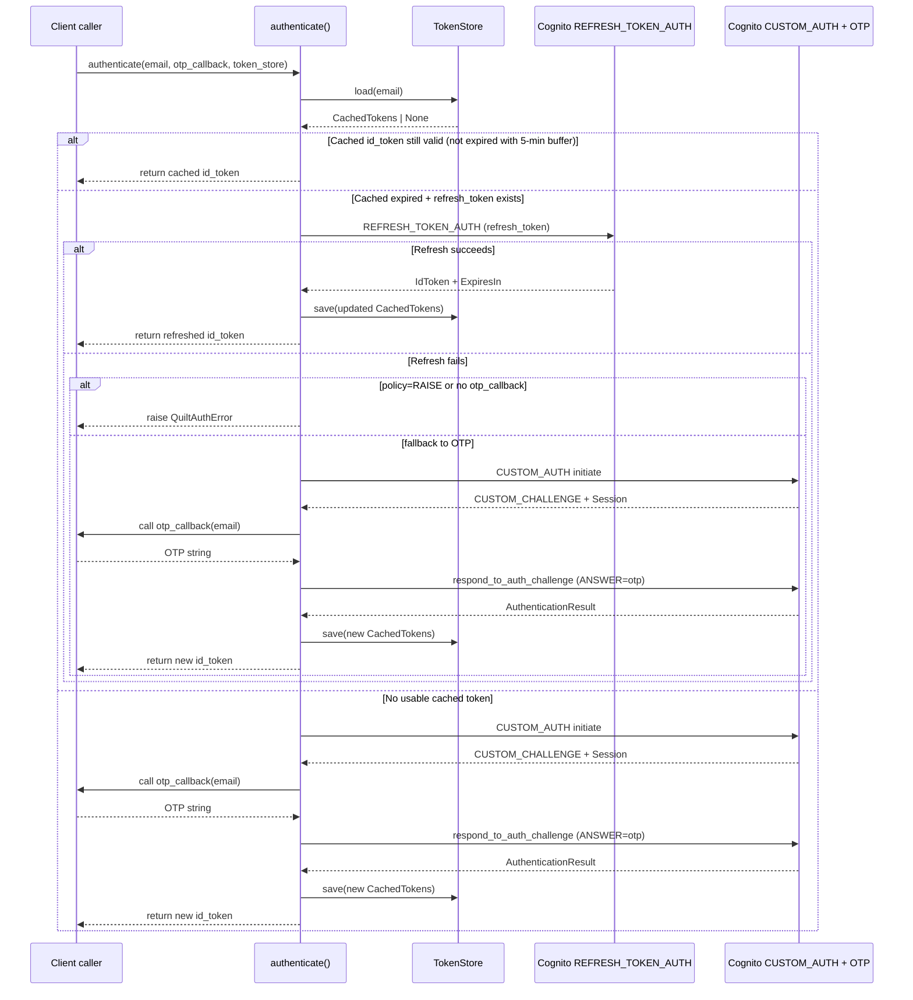
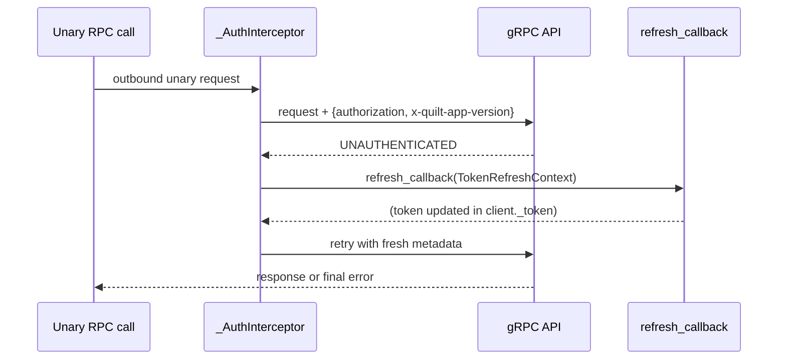

# Transport and authentication protocol behavior

This page is the definitive reference for how the library establishes TLS connections, injects authentication metadata, handles token refresh, and implements the Cognito OTP login flow. It is intended for contributors, alternate-client implementers, and anyone debugging authentication issues.

## TLS channel creation

The library connects to the Quilt gRPC API over TLS. The `create_channel()` function in `transport.py` is responsible:

```python
def create_channel(
    token_provider: TokenProviderLike,
    environment: Environment = Environment.PROD,
    refresh_callback: RefreshCallback | None = None,
) -> grpc.aio.Channel:
```

It calls `grpc.aio.secure_channel(host, grpc.ssl_channel_credentials(), options=..., interceptors=[...])`. The TLS credentials use the system certificate store — no custom CA is required.

### Endpoints

| `Environment` | gRPC host |
| --- | --- |
| `Environment.PROD` | `api.prod.quilt.cloud:443` |
| `Environment.STAGING` | `api.staging.quilt.cloud:443` |
| `Environment.DEV` | `api.dev.quilt.cloud:443` |

`QuiltClient` defaults to `Environment.PROD`. Pass `environment=Environment.STAGING` to the constructor for staging.

### Channel keepalive options

The channel is created with these options (defined in `const.py`):

| Option | Value |
| --- | --- |
| `grpc.keepalive_time_ms` | `30000` (30 seconds) |
| `grpc.keepalive_timeout_ms` | `10000` (10 seconds) |
| `grpc.keepalive_permit_without_calls` | `1` (keepalives sent even when no calls are in-flight) |
| `grpc.http2.max_pings_without_data` | `0` (no cap on pings without data) |

These settings keep long-lived connections (especially the notification stream) alive through NAT devices and load balancers.

## The `_AuthInterceptor`

Every outbound call has two metadata headers injected by `_AuthInterceptor`:

- `authorization` — the current Cognito IdToken (JWT), obtained by calling `token_provider()`.
- `x-quilt-app-version` — the string `"1.0.25"` (the `APP_VERSION` constant).

The interceptor implements all four gRPC async client interceptor interfaces:

- `UnaryUnaryClientInterceptor`
- `UnaryStreamClientInterceptor`
- `StreamUnaryClientInterceptor`
- `StreamStreamClientInterceptor`

For **unary RPCs** (`intercept_unary_unary`, `intercept_unary_stream`): if the call fails with `grpc.StatusCode.UNAUTHENTICATED` and a `refresh_callback` is configured, the interceptor awaits the callback (which refreshes the token) and retries the call exactly once with fresh metadata. If the retry also fails, the error is propagated.

For **streaming RPCs** (`intercept_stream_unary`, `intercept_stream_stream`): metadata is injected but no retry logic is applied. The `NotifierStream` handles its own reconnect on `UNAUTHENTICATED`.

## Authentication lifecycle

Authentication is handled by `authenticate()` in `auth.py`. It implements a three-step resolution:



### Step 1: Cached token

If `token_store` is provided, `authenticate()` calls `token_store.load(email)`. If the returned `CachedTokens` has `is_expired == False`, the `id_token` is returned immediately with no network call. The `is_expired` check applies a 5-minute buffer: `time.time() > expires_at - 300`. This means the token is treated as expired 5 minutes before it actually expires, giving the app time to refresh without racing an actual expiry.

### Step 2: Refresh token

If the cached IdToken is expired but a `refresh_token` is present, `authenticate()` attempts Cognito `REFRESH_TOKEN_AUTH`:

```
cognito.initiate_auth(
    AuthFlow="REFRESH_TOKEN_AUTH",
    AuthParameters={"REFRESH_TOKEN": refresh_token},
    ClientId=COGNITO_CLIENT_ID,
)
```

On success, the response contains a new `IdToken` and `ExpiresIn`. The `refresh_token` itself is **not** rotated — the existing one is preserved. A new `CachedTokens` is built with the new `id_token` and saved back to the store.

If the refresh fails, the `TokenRefreshHooks.on_refresh_failure` hook is called (if configured), and then `TokenRefreshPolicy.on_refresh_failure` is consulted:
- `RefreshFailureAction.RAISE` — raise the error immediately.
- `RefreshFailureAction.FALLBACK_TO_OTP` — fall through to step 3. This is the default when no policy is configured.

### Step 3: OTP login

The OTP login uses Cognito's custom-auth challenge flow:

1. `initiate_auth(AuthFlow="CUSTOM_AUTH", AuthParameters={"USERNAME": email}, ClientId=..., ClientMetadata={})` — initiates the flow. Cognito sends an OTP to the user's email and returns `ChallengeName="CUSTOM_CHALLENGE"` plus a `Session` string.

2. `otp_callback(email)` is called — the application asks the user for the OTP code. The callback can be synchronous or asynchronous.

3. `respond_to_auth_challenge(ChallengeName="CUSTOM_CHALLENGE", Session=session, ChallengeResponses={"USERNAME": email, "ANSWER": otp}, ClientId=..., ClientMetadata={})` — submits the OTP. On success, the response contains `AuthenticationResult` with `IdToken`, `RefreshToken`, and `ExpiresIn`.

All Cognito errors are caught as `botocore.exceptions.ClientError` and re-raised as `QuiltAuthError` with the Cognito error code and message included.

### AWS SDK threading

boto3 is synchronous. `authenticate()` runs boto3 calls in `asyncio.get_running_loop().run_in_executor(None, partial(...))` to avoid blocking the event loop.

## `UNAUTHENTICATED` retry behavior

### Unary RPCs (via interceptor)

When a unary RPC returns `grpc.StatusCode.UNAUTHENTICATED`:

1. `_AuthInterceptor._refresh_and_retry()` is called.
2. If `refresh_callback` is set, it is awaited with a `TokenRefreshContext(reason=TRANSPORT_UNAUTHENTICATED, source="transport")`.
3. The call is retried once with freshly injected metadata.

If the retry also fails with `UNAUTHENTICATED`, the error is propagated to the caller.

### Bidirectional stream (via `NotifierStream`)

The notification stream handles its own reconnect. When the stream receives `AioRpcError` with code `UNAUTHENTICATED`:

1. The `_authenticate` callback (set to `client.refresh_token`) is awaited with `TokenRefreshContext(reason=STREAM_UNAUTHENTICATED, source="streaming", attempt=n)`.
2. After refresh, the stream sleeps for the current back-off delay, resets its request queue, and reconnects.
3. If the refresh callback itself raises, the stream sets a fatal error and stops reconnecting.

See [Streaming protocol behavior](streaming-protocol.md) for the full reconnect flow.



## Token expiry buffer and race conditions

The 300-second buffer in `CachedTokens.is_expired` is the defence against the scenario where a token is valid at the start of an operation but expires before the RPC completes. With a 5-minute buffer, any token that the cache returns as "not expired" will remain valid long enough to complete typical API calls. In practice, Cognito IdTokens are valid for 1 hour, so the buffer trades at most 5 minutes of effective lifetime for reliability.
