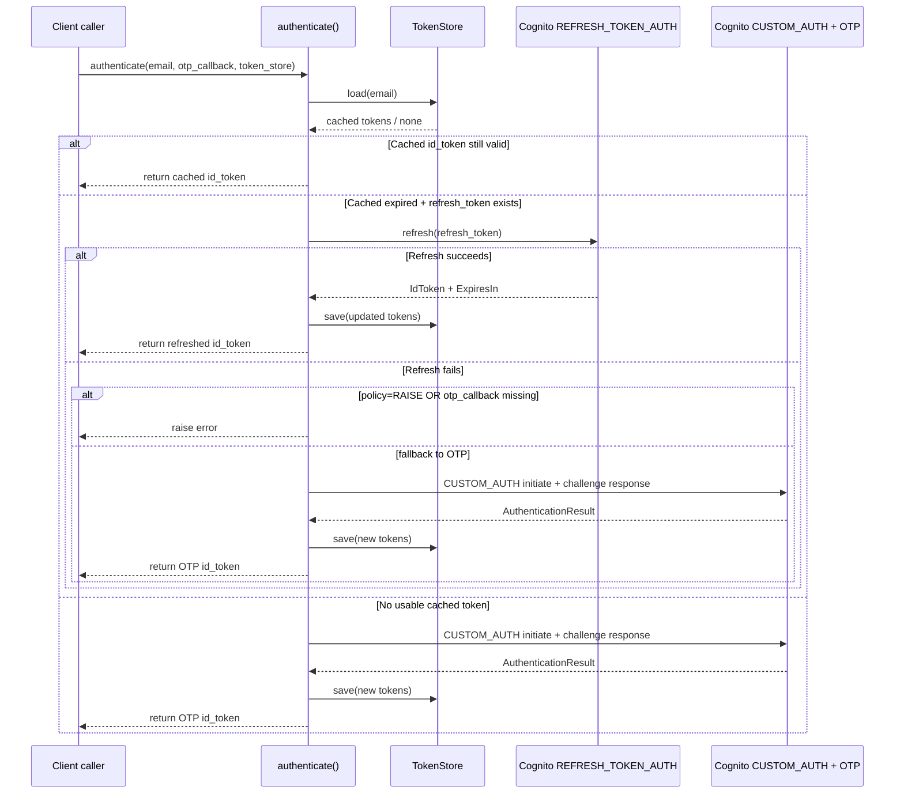
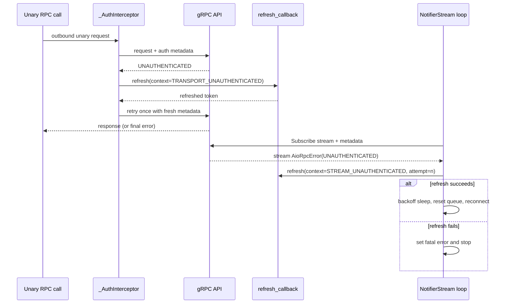

# Transport and authentication protocol behavior

This page documents transport/auth behavior for alternate-client implementers.

## Endpoints, environment selection, metadata, and TLS

Environment selection is explicit in `QuiltClient(..., environment=...)` and defaults to `Environment.PROD`.

| Environment | gRPC endpoint |
| --- | --- |
| `prod` | `api.prod.quilt.cloud:443` |
| `staging` | `api.staging.quilt.cloud:443` |
| `dev` | `api.dev.quilt.cloud:443` |

Transport always uses TLS via `grpc.aio.secure_channel(..., grpc.ssl_channel_credentials(), ...)`.

Per-RPC metadata added by transport:

- `authorization`: current token string from token provider (`QuiltClient.get_current_token()` in default flow)
- `x-quilt-app-version`: current `APP_VERSION`

Channel options are currently:

- `grpc.keepalive_time_ms=30000`
- `grpc.keepalive_timeout_ms=10000`
- `grpc.keepalive_permit_without_calls=1`
- `grpc.http2.max_pings_without_data=0`

## Authentication lifecycle

### 1) Cached token path

- `authenticate()` first loads cached tokens from `token_store` (async or sync store supported).
- If `cached.is_expired` is false, `id_token` is returned immediately.
- Expiry uses a 5-minute safety buffer (`CachedTokens.is_expired` compares `time.time()` to `expires_at - 300`).

### 2) Refresh path

- If cached token is expired and a `refresh_token` exists, `authenticate()` attempts Cognito `REFRESH_TOKEN_AUTH`.
- Successful refresh updates `id_token`, preserves existing `refresh_token`, recomputes expiry from `ExpiresIn`, and saves to store.
- `TokenRefreshContext` carries `reason`, `source`, and `attempt` metadata.
- `TokenRefreshHooks` lifecycle:
  - `on_refresh_start(context)` before refresh attempt
  - `on_refresh_success(context, tokens)` on success
  - `on_refresh_failure(context, error)` on failure
- `TokenRefreshPolicy.on_refresh_failure(...)` decides:
  - `FALLBACK_TO_OTP` (default behavior if no policy is provided)
  - `RAISE` (do not fallback)

Failure behavior:

- If refresh fails and policy says `RAISE`, error is raised.
- If refresh fails and no OTP callback is available, error is raised.
- Otherwise it falls through to OTP login.

### 3) OTP login path

OTP flow is Cognito custom-auth challenge:

1. `initiate_auth(AuthFlow="CUSTOM_AUTH", AuthParameters={"USERNAME": email}, ClientId=...)`
2. Validate `ChallengeName == "CUSTOM_CHALLENGE"` and `Session` exists
3. Obtain OTP from caller-provided callback (sync or async supported)
4. `respond_to_auth_challenge(..., ChallengeResponses={"USERNAME": email, "ANSWER": otp})`
5. Read `AuthenticationResult` and persist tokens if store is configured

Errors are surfaced as `QuiltAuthError` with Cognito error code/message context.

## UNAUTHENTICATED handling and retry behavior

### Unary RPC transport interceptor

- Interceptor handles `unary-unary` and `unary-stream`.
- On `grpc.StatusCode.UNAUTHENTICATED` and when `refresh_callback` is configured:
  1. invoke refresh callback (context reason `TRANSPORT_UNAUTHENTICATED`, source `"transport"`)
  2. retry original call exactly once with refreshed metadata
- For non-`UNAUTHENTICATED` errors, interceptor re-raises.
- `stream-unary` and `stream-stream` interceptor methods currently inject metadata only; no built-in retry path.

### Bidirectional streaming (`NotifierStream`)

- `QuiltClient.stream(...)` supplies:
  - `metadata_provider=lambda: auth_metadata(self)`
  - `authenticate=self.refresh_token`
- Stream loop behavior on `AioRpcError`:
  - If `UNAUTHENTICATED`, `authenticate` exists, and reconnect budget remains:
    - call auth refresh callback with context reason `STREAM_UNAUTHENTICATED`, source `"streaming"`, current attempt number
    - then sleep/backoff and reconnect
  - If refresh callback fails: set stream error and stop reconnecting
  - For other gRPC errors with retries remaining: exponential backoff reconnect
  - If retries exhausted: raise/store `QuiltStreamError("Stream error: <code> - 
")`

Reconnect backoff starts at configured `reconnect_delay_s`, doubles each attempt, capped at 60s.

## Error model basics (auth/transport relevant)

### Status handling in implementation

- `UNAUTHENTICATED`: special-cased for refresh-and-retry flows (transport interceptor and stream manager)
- Other gRPC statuses:
  - transport unary path: propagated as original `grpc.aio.AioRpcError`
  - stream path: retried while budget remains; eventually wrapped as `QuiltStreamError`
- Cognito/auth failures are raised as `QuiltAuthError` (not gRPC status-based)

### Status meaning notes

- `UNAUTHENTICATED`: request lacks valid auth credentials.
- `UNAVAILABLE`: transient service/connectivity issue, often retryable.
- `INTERNAL`/`UNKNOWN`: server-side or unmapped failures; generally not auto-recoverable without retry policy.

## Sequence diagrams

### Login/auth lifecycle (cache → refresh → OTP fallback)

### UNAUTHENTICATED refresh/retry paths (unary + stream)

