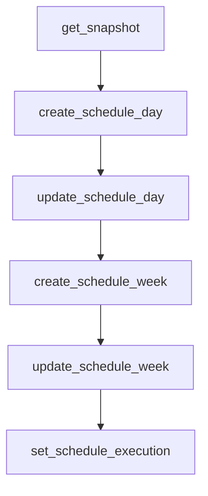

# Advanced workflows

This page covers end-to-end patterns for common integration tasks.

## Authentication and token management workflow

For full token lifecycle details, see
[Token management reference](token-management.md). Use this workflow page for
how to apply those controls in host applications.

```python
import asyncio
from quilt_hp import QuiltClient
from quilt_hp.tokens import (
    CachedTokens,
    RefreshFailureAction,
    TokenRefreshContext,
    TokenRefreshPolicy,
)


class RefreshHooks:
    async def on_refresh_start(self, context: TokenRefreshContext) -> None:
        print("refresh start:", context.reason, context.source, context.attempt)

    async def on_refresh_success(
        self,
        context: TokenRefreshContext,
        tokens: CachedTokens,
    ) -> None:
        print("refresh success:", context.reason, int(tokens.expires_at))

    async def on_refresh_failure(
        self,
        context: TokenRefreshContext,
        error: Exception,
    ) -> None:
        print("refresh failure:", context.reason, repr(error))


class RefreshPolicy:
    def on_refresh_failure(
        self,
        context: TokenRefreshContext,
        error: Exception,
    ) -> RefreshFailureAction:
        if context.source == "authenticate":
            return RefreshFailureAction.FALLBACK_TO_OTP
        return RefreshFailureAction.RAISE


async def prompt_otp(email: str) -> str:
    return input(f"OTP for {email}: ")


async def main() -> None:
    async with QuiltClient(
        "user@example.com",
        token_refresh_hooks=RefreshHooks(),
        token_refresh_policy=RefreshPolicy(),
    ) as client:
        await client.login(otp_callback=prompt_otp)
        await client.get_snapshot()


asyncio.run(main())
```

## Schedule API: create and modify schedules

Use `ScheduleEvent` and `ScheduleWeekDay` models, then call create/update
methods on `QuiltClient`.

```python
import asyncio
from quilt_hp import QuiltClient
from quilt_hp.models.enums import ComfortSettingType, HVACMode
from quilt_hp.models.schedule import ScheduleEvent, ScheduleWeekDay


async def main() -> None:
    async with QuiltClient("user@example.com") as client:
        await client.login(otp_callback=lambda email: input(f"OTP for {email}: "))
        snapshot = await client.get_snapshot()

        room = next(space for space in snapshot.rooms if space.name == "Bedroom")
        day = await client.create_schedule_day(
            space_id=room.id,
            name="Weekday Morning",
            events=[
                ScheduleEvent(
                    start_s=6 * 3600,
                    comfort_setting_id=None,
                    comfort_setting_type=ComfortSettingType.HOME,
                    hvac_mode=HVACMode.HEAT,
                    heating_setpoint_c=20.5,
                    cooling_setpoint_c=26.0,
                ),
            ],
        )

        day = await client.update_schedule_day(
            schedule_day_id=day.id,
            space_id=room.id,
            name="Weekday Morning v2",
            events=[
                ScheduleEvent(
                    start_s=5 * 3600 + 30 * 60,
                    comfort_setting_id=None,
                    comfort_setting_type=ComfortSettingType.HOME,
                    hvac_mode=HVACMode.HEAT,
                    heating_setpoint_c=21.0,
                    cooling_setpoint_c=26.0,
                ),
            ],
        )

        week = await client.create_schedule_week(
            space_id=room.id,
            days=[
                ScheduleWeekDay(weekday=1, day_id=day.id),
                ScheduleWeekDay(weekday=2, day_id=day.id),
                ScheduleWeekDay(weekday=3, day_id=day.id),
                ScheduleWeekDay(weekday=4, day_id=day.id),
                ScheduleWeekDay(weekday=5, day_id=day.id),
            ],
        )

        await client.update_schedule_week(
            schedule_week_id=week.id,
            space_id=room.id,
            days=[
                ScheduleWeekDay(weekday=1, day_id=day.id),
                ScheduleWeekDay(weekday=2, day_id=day.id),
                ScheduleWeekDay(weekday=3, day_id=day.id),
                ScheduleWeekDay(weekday=4, day_id=day.id),
                ScheduleWeekDay(weekday=5, day_id=day.id),
            ],
        )

        await client.set_schedule_execution(paused=False)


asyncio.run(main())
```



## Energy API with room and device sensor context

`get_energy()` returns hourly energy buckets per space. Combine this with
snapshot room telemetry (`Space.state`) and device telemetry
(`IndoorUnit.state`, `IndoorUnit.performance_data`) in the same reporting
window.

```python
import asyncio
from datetime import datetime, timedelta, timezone
from quilt_hp import QuiltClient


async def main() -> None:
    async with QuiltClient("user@example.com") as client:
        await client.login(otp_callback=lambda email: input(f"OTP for {email}: "))

        end = datetime.now(timezone.utc)
        start = end - timedelta(hours=24)
        energy = await client.get_energy(start=start, end=end)
        snapshot = await client.get_snapshot()

        rooms = {space.id: space for space in snapshot.rooms}
        idus_by_space: dict[str, list] = {}
        for idu in snapshot.indoor_units:
            idus_by_space.setdefault(idu.space_id, []).append(idu)

        for metric in energy:
            room = rooms.get(metric.space_id)
            room_name = room.name if room else metric.space_id
            ambient = room.state.ambient_temperature_c if room else None
            idus = idus_by_space.get(metric.space_id, [])
            idu_ambient = [
                idu.state.ambient_temperature_c for idu in idus if idu.state
            ]
            print(
                room_name,
                "kWh=", round(metric.total_kwh, 3),
                "room_ambient=", ambient,
                "idu_ambient_values=", idu_ambient,
            )


asyncio.run(main())
```

## Changing settings safely

Settings APIs are:

- `set_space_settings(...)` for occupancy timeout behavior.
- `set_indoor_unit_settings(...)` for radar fence and default light behavior.

Pattern:

1. Read current snapshot.
2. Apply only intended changes.
3. Re-read and verify effective settings.

```python
import asyncio
from quilt_hp import QuiltClient


async def main() -> None:
    async with QuiltClient("user@example.com") as client:
        await client.login(otp_callback=lambda email: input(f"OTP for {email}: "))
        snapshot = await client.get_snapshot()

        room = next(space for space in snapshot.rooms if space.name == "Office")
        idu = next(unit for unit in snapshot.indoor_units if unit.space_id == room.id)

        await client.set_space_settings(
            room,
            occupied_timeout_s=3600,
            unoccupied_timeout_s=1800,
        )
        await client.set_indoor_unit_settings(
            idu,
            fence_left_m=1.0,
            fence_right_m=3.0,
            fence_forward_m=2.0,
            radar_height_m=2.2,
            light_brightness_default=0.25,
        )

        updated = await client.get_snapshot()
        room2 = next(space for space in updated.rooms if space.id == room.id)
        idu2 = next(unit for unit in updated.indoor_units if unit.id == idu.id)
        print("space timeouts:", room2.settings.occupied_timeout_s)
        print("idu fence left:", idu2.settings.presence_fence_left_m)


asyncio.run(main())
```
