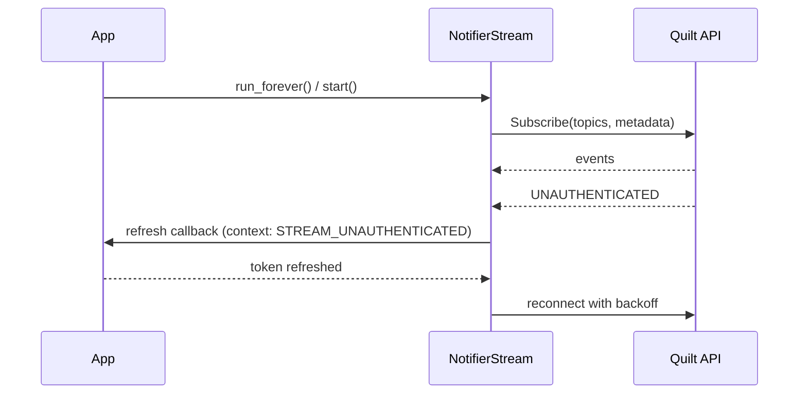

# QuiltClient API reference

`QuiltClient` is the high-level async facade in `quilt_hp.client`. It owns auth, channel lifecycle, system targeting, state reads, control writes, schedules, energy queries, and stream creation.

## Construction

```python
QuiltClient(
    email: str,
    *,
    home: str | None = None,
    environment: Environment = Environment.PROD,
    snapshot_ttl_s: float = 0,
    token_store: TokenStoreLike | None = None,
    token_refresh_hooks: TokenRefreshHooks | None = None,
    token_refresh_policy: TokenRefreshPolicy | None = None,
)
```

Behavior notes:

- `email` is the account identity for OTP and token lookup.
- `home` is a substring filter used by `get_system_id()` when multiple systems exist.
- `snapshot_ttl_s > 0` enables cached default-snapshot reads.
- `token_store` enables token persistence/refresh without OTP every run.
- hooks/policy are optional host controls around refresh failures.

Common error conditions:

- Auth failures raise `QuiltAuthError`.
- gRPC/service failures raise `QuiltError` (or `QuiltNotFoundError` for missing system in snapshot fetch).

## Lifecycle and auth

### `login(otp_callback: OtpCallback | None = None) -> None`

Authenticates and initializes service wrappers/channel.

- Uses cached token first, then refresh token, then OTP (if needed).
- OTP callback can be sync or async.

Errors:

- `QuiltAuthError` if no valid cache and no `otp_callback`, or Cognito challenge fails.

### `refresh_token(context: TokenRefreshContext | None = None) -> None`

Refresh-only auth path (no OTP fallback from this call site).

- Default context: `EXPIRED_CACHED_TOKEN`, source `"client"`.
- Used by transport and stream retry paths with specific refresh reasons.

### `close() -> None`, `async with QuiltClient(...)`

Closes gRPC channel. Context manager calls `close()` in `__aexit__`.

### `get_current_token() -> str`

Token-provider method for transport metadata.

Errors:

- `QuiltAuthError` if `login()` has not completed.

## System discovery and snapshot/cache

### `list_systems() -> list[SystemInfo]`

Lists systems available to authenticated user.

### `system_name: str | None`

Resolved system name after `get_system_id()`.

### `get_system_id(home: str | None = None) -> str`

Resolves and caches system id.

Behavior notes:

- If `home` is omitted and cached id exists, cached value is returned.
- If a specific `home` filter is provided, cache is bypassed unless it matches configured `self._home`.
- With no filter, the first returned system is treated as primary.

Errors:

- `QuiltError` when no systems exist or no home name matches.

### `get_snapshot(system_id: str | None = None) -> SystemSnapshot`

Returns full HomeDatastore snapshot.

Cache behavior:

- Cache only applies when `system_id is None` and `snapshot_ttl_s > 0`.
- Passing explicit `system_id` bypasses cache and does not populate default cache.

### `invalidate_snapshot() -> None`

Clears cached snapshot/timestamp.

```mermaid
flowchart TD
    A[get_snapshot() called] --> B{system_id passed?}
    B -->|yes| C[Fetch from HDS]
    B -->|no| D{snapshot_ttl_s > 0 and cache fresh?}
    D -->|yes| E[Return cached snapshot]
    D -->|no| F[Fetch from HDS]
    F --> G[Update cache+timestamp]
    C --> H[Return snapshot]
    E --> H
    G --> H
```

## Controls

### Spaces

- `list_spaces() -> list[Space]`
- `set_space(space, *, mode=None, heat_setpoint_c=None, cool_setpoint_c=None) -> Space`
- `set_space_settings(space, *, unoccupied_timeout_s=None, occupied_timeout_s=None) -> Space`

Behavior notes:

- `space` may be `Space` object or `space_id` string.
- String ids trigger snapshot lookup; object input avoids extra lookup.
- `set_space()` enforces service logic such as AUTO heat/cool separation and STANDBY comfort-association clearing.

Errors:

- `QuiltError` if string id cannot be resolved.

### Indoor units

- `list_indoor_units() -> list[IndoorUnit]`
- `set_indoor_unit(idu, *, fan_speed=None, louver_mode=None, louver_position=None, led_color_code=None, led_brightness=None, led_animation=None) -> IndoorUnit`
- `set_indoor_unit_settings(idu, *, fence_left_m=None, fence_right_m=None, fence_forward_m=None, radar_height_m=None, light_brightness_default=None) -> IndoorUnit`

Behavior notes:

- Accepts object or id string; id uses snapshot resolution.
- Fence values are meters; `0.0` can be used to clear boundaries.

### Comfort presets

- `list_comfort_settings() -> list[ComfortSetting]`
- `update_comfort_setting(setting, *, name=None, hvac_mode=None, heat_setpoint_c=None, cool_setpoint_c=None, fan_speed=None) -> ComfortSetting`

## Schedules

- `create_schedule_day(space_id, name, events) -> ScheduleDay`
- `update_schedule_day(schedule_day_id, space_id, name=None, events=None) -> ScheduleDay`
- `delete_schedule_day(schedule_day_id) -> None`
- `create_schedule_week(space_id, days=None) -> ScheduleWeek`
- `update_schedule_week(schedule_week_id, space_id, days) -> ScheduleWeek`
- `delete_schedule_week(schedule_week_id) -> None`
- `set_schedule_execution(paused: bool) -> None`

Behavior notes:

- Day/week create/update methods resolve `system_id` from current target system.
- `set_schedule_execution()` modifies primary location execution flag.

Errors:

- `QuiltError` if no location exists in snapshot for schedule execution toggle.

## Energy

### `get_energy(start: datetime, end: datetime, system_id: str | None = None) -> list[SpaceEnergyMetrics]`

- Uses hourly resolution from `SystemInformationService`.
- Explicit `system_id` overrides default resolved system.

## Streaming

### `stream(topics: list[str], *, max_reconnects: int = -1, reconnect_delay_s: float = 1.0) -> NotifierStream`

Creates a `NotifierStream` configured with auth metadata and refresh callback.

Behavior notes:

- `max_reconnects=-1` means unlimited reconnect attempts.
- Backoff doubles per attempt up to 60s in stream implementation.
- Stream UNAUTHENTICATED refresh context uses reason `STREAM_UNAUTHENTICATED`.



## User

### `get_current_user() -> User`

Returns current account profile (`id`, `first_name`, `last_name`, `email`,
`phone_number`).

### `update_current_user(*, first_name: str, last_name: str, phone_number: str | None = None) -> User`

Updates current account profile fields through `UserService.UpdateLoggedInUser`.

### `get_user_attributes() -> UserAttributes`

Returns user attributes, including `declared_user_type`.

### `patch_user_attributes(*, declared_user_type: DeclaredUserType) -> UserAttributes`

Patches current user attributes through `UserService.PatchUserAttributes`.

## Auth/refresh lifecycle diagram

```mermaid
flowchart TD
    A[login()] --> B[authenticate()]
    B --> C{Cached token valid?}
    C -->|yes| D[Use cached IdToken]
    C -->|no| E{Refresh token available?}
    E -->|yes| F[Attempt refresh]
    F --> G{Refresh success?}
    G -->|yes| H[Save tokens and continue]
    G -->|no| I{Policy allows OTP fallback?}
    I -->|yes| J[OTP login flow]
    I -->|no| K[Raise auth error]
    E -->|no| J
    J --> L[Save tokens and continue]
```
