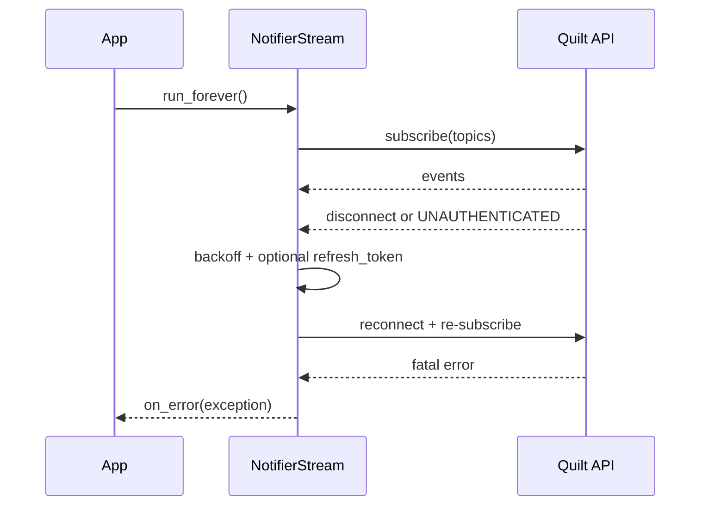

# Python API examples cookbook

These examples are intentionally "runnable-ish": copy them into scripts, replace account/home values, and run with an event loop. All snippets use implemented APIs in `src/quilt_hp`.

## 1) Authenticated client lifecycle with token persistence

**Context:** long-running integration that should prompt for OTP only when needed.  
**Assumptions:** first run may need OTP; later runs can use refresh tokens.  
**Expected behavior:** `login()` reuses cached tokens when valid, refreshes when expired, and only falls back to OTP if required.

```mermaid
flowchart TD
    A[client.login()] --> B{cached id token valid?}
    B -->|yes| C[continue]
    B -->|no| D{refresh token available?}
    D -->|yes| E[refresh + save]
    D -->|no| F[OTP callback]
    E --> C
    F --> G[save tokens]
    G --> C
```

```python
import asyncio
from quilt_hp import QuiltClient
from quilt_hp.tokens import CachedTokens, TokenStore


class InMemoryTokenStore(TokenStore):
    def __init__(self) -> None:
        self._cache: dict[str, CachedTokens] = {}

    async def load(self, email: str) -> CachedTokens | None:
        return self._cache.get(email)

    async def save(self, email: str, tokens: CachedTokens) -> None:
        self._cache[email] = tokens


async def prompt_otp(email: str) -> str:
    return input(f"Enter OTP for {email}: ").strip()


async def main() -> None:
    token_store = InMemoryTokenStore()

    async with QuiltClient("user@example.com", token_store=token_store) as client:
        await client.login(otp_callback=prompt_otp)
        user = await client.get_current_user()
        print(f"Authenticated as {user.email}")


asyncio.run(main())
```

## 2) Read-only snapshot polling (with TTL cache)

**Context:** dashboard or exporter that polls often without writing controls.  
**Assumptions:** "fresh enough" data within a short cache window is acceptable.  
**Expected behavior:** repeated `get_snapshot()` calls inside the TTL reuse cache; periodic invalidation forces a fresh fetch.

```python
import asyncio
from quilt_hp import QuiltClient


async def main() -> None:
    async with QuiltClient("user@example.com", snapshot_ttl_s=10) as client:
        await client.login(otp_callback=lambda email: input(f"OTP for {email}: "))

        for i in range(1, 31):
            snapshot = await client.get_snapshot()
            rows = [
                (room.name, room.state.ambient_temperature_c, room.controls.display_setpoint)
                for room in snapshot.rooms
            ]
            print(f"poll={i} rooms={rows}")

            if i % 10 == 0:
                client.invalidate_snapshot()  # force a network refresh next cycle

            await asyncio.sleep(2)


asyncio.run(main())
```

## 3) Control updates (space mode/setpoints + indoor unit controls)

**Context:** automation rule updates room comfort and matching IDU behavior.  
**Assumptions:** room and IDU names are stable enough to discover from snapshot.  
**Expected behavior:** space control update succeeds first; IDU control update then applies fan/louver/LED choices.

```python
import asyncio
from quilt_hp import QuiltClient
from quilt_hp.models.enums import FanSpeed, HVACMode, LouverMode


async def main() -> None:
    async with QuiltClient("user@example.com") as client:
        await client.login(otp_callback=lambda email: input(f"OTP for {email}: "))
        snapshot = await client.get_snapshot()

        living = next(space for space in snapshot.rooms if space.name == "Living Room")
        idu = next(unit for unit in snapshot.indoor_units if unit.space_id == living.id)

        updated_space = await client.set_space(
            living,
            mode=HVACMode.COOL,
            cool_setpoint_c=22.0,
        )
        print("space setpoint:", updated_space.controls.display_setpoint)

        updated_idu = await client.set_indoor_unit(
            idu.id,  # string IDs are supported and resolved through snapshot
            fan_speed=FanSpeed.MEDIUM,
            louver_mode=LouverMode.SWEEP,
            led_brightness=0.35,
        )
        print("idu fan:", updated_idu.controls.fan_speed.name)


asyncio.run(main())
```

## 4) Streaming subscriber with reconnect and error handling

**Context:** host process keeping near-real-time local state.  
**Assumptions:** occasional disconnects or token expiry may happen during runtime.  
**Expected behavior:** stream auto-reconnects (with backoff), refreshes auth when needed, and exposes fatal errors via `on_error`.



```python
import asyncio
from quilt_hp import QuiltClient


async def main() -> None:
    async with QuiltClient("user@example.com") as client:
        await client.login(otp_callback=lambda email: input(f"OTP for {email}: "))
        snapshot = await client.get_snapshot()

        def on_space(space) -> None:
            merged = snapshot.apply_space(space)
            print("space update:", merged.name, merged.controls.display_setpoint)

        async def on_error(exc: Exception) -> None:
            print(f"stream fatal error: {exc!r}")

        stream = client.stream(
            snapshot.stream_topics(),
            max_reconnects=-1,
            reconnect_delay_s=1.0,
        )
        stream.on_space_update(on_space)
        stream.on_error(on_error)
        await stream.run_forever()


asyncio.run(main())
```

## 5) Custom token store implementation pattern (sync or async backends)

**Context:** production integration storing secrets outside process memory.  
**Assumptions:** host has secure persistence (DB, keyring, KMS-backed vault, etc.).  
**Expected behavior:** client accepts either async (`TokenStore`) or sync (`LegacyTokenStore`) implementations.

```python
import json
from pathlib import Path
from quilt_hp.tokens import CachedTokens, LegacyTokenStore


class JsonTokenStore(LegacyTokenStore):
    def __init__(self, path: Path = Path(".quilt_tokens.json")) -> None:
        self._path = path

    def load(self, email: str) -> CachedTokens | None:
        if not self._path.exists():
            return None
        data = json.loads(self._path.read_text())
        row = data.get(email)
        if row is None:
            return None
        return CachedTokens(
            id_token=row["id_token"],
            refresh_token=row["refresh_token"],
            expires_at=float(row["expires_at"]),
        )

    def save(self, email: str, tokens: CachedTokens) -> None:
        data = json.loads(self._path.read_text()) if self._path.exists() else {}
        data[email] = {
            "id_token": tokens.id_token,
            "refresh_token": tokens.refresh_token,
            "expires_at": tokens.expires_at,
        }
        self._path.write_text(json.dumps(data))
```

Use it with `QuiltClient("user@example.com", token_store=JsonTokenStore())`. For production, replace JSON-file storage with an encrypted backend.

## 6) Refresh hooks and policy control example

**Context:** host app needs telemetry around refresh behavior and different
fallback behavior by call path.  
**Expected behavior:** refresh lifecycle hooks emit observability events and
policy can force raise vs OTP fallback.

```python
import asyncio
from quilt_hp import QuiltClient
from quilt_hp.tokens import (
    CachedTokens,
    RefreshFailureAction,
    TokenRefreshContext,
)


class Hooks:
    async def on_refresh_start(self, context: TokenRefreshContext) -> None:
        print("start", context.reason, context.source, context.attempt)

    async def on_refresh_success(
        self,
        context: TokenRefreshContext,
        tokens: CachedTokens,
    ) -> None:
        print("success", context.reason, int(tokens.expires_at))

    async def on_refresh_failure(
        self,
        context: TokenRefreshContext,
        error: Exception,
    ) -> None:
        print("failure", context.reason, repr(error))


class Policy:
    def on_refresh_failure(
        self,
        context: TokenRefreshContext,
        error: Exception,
    ) -> RefreshFailureAction:
        if context.source == "authenticate":
            return RefreshFailureAction.FALLBACK_TO_OTP
        return RefreshFailureAction.RAISE


async def main() -> None:
    async with QuiltClient(
        "user@example.com",
        token_refresh_hooks=Hooks(),
        token_refresh_policy=Policy(),
    ) as client:
        await client.login(otp_callback=lambda email: input(f"OTP for {email}: "))
        await client.get_snapshot()


asyncio.run(main())
```

## 7) Home Assistant-style coordinator loop skeleton

**Context:** host integration needs stable periodic refresh with optional stream
acceleration.  
**Expected behavior:** polling remains source-of-truth and stream callbacks
apply sparse updates into current snapshot.

```python
import asyncio
from quilt_hp import QuiltClient


class Coordinator:
    def __init__(self, client: QuiltClient, poll_interval_s: float = 60) -> None:
        self.client = client
        self.poll_interval_s = poll_interval_s
        self.snapshot = None

    async def refresh(self) -> None:
        self.snapshot = await self.client.get_snapshot()
        print("rooms:", [room.name for room in self.snapshot.rooms])

    async def run(self) -> None:
        while True:
            await self.refresh()
            await asyncio.sleep(self.poll_interval_s)


async def main() -> None:
    async with QuiltClient("user@example.com") as client:
        await client.login(otp_callback=lambda email: input(f"OTP for {email}: "))
        coordinator = Coordinator(client, poll_interval_s=30)
        await coordinator.refresh()

        stream = client.stream(coordinator.snapshot.stream_topics())
        stream.on_space_update(lambda space: coordinator.snapshot.apply_space(space))
        stream_task = asyncio.create_task(stream.run_forever())
        poll_task = asyncio.create_task(coordinator.run())
        await asyncio.gather(stream_task, poll_task)


asyncio.run(main())
```
