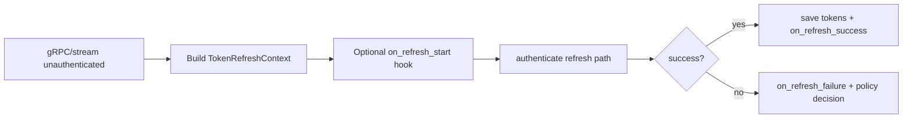

# Token management reference

Auth/token logic is implemented in `quilt_hp.auth` and `quilt_hp.tokens`.

## Token datatypes and protocols

### `CachedTokens`

```python
CachedTokens(id_token: str, refresh_token: str, expires_at: float)
```

- `expires_at` is unix seconds.
- `is_expired` uses a 5-minute safety buffer before true expiry.

### `TokenStore` and `LegacyTokenStore`

`TokenStore` (async protocol):

- `load(email) -> CachedTokens | None`
- `save(email, tokens) -> None`

`LegacyTokenStore` (sync compatibility protocol) has the same method names/signatures without `async`.

### `TokenStoreLike`

Union accepted by client/auth paths:

- `TokenStore | LegacyTokenStore`

Host integrations can keep existing sync stores or migrate to async stores.

## Refresh lifecycle controls

### `TokenRefreshReason`

Implemented reasons:

- `EXPIRED_CACHED_TOKEN`
- `TRANSPORT_UNAUTHENTICATED`
- `STREAM_UNAUTHENTICATED`

### `TokenRefreshContext`

```python
TokenRefreshContext(reason, source, attempt=1)
```

- `reason`: one of `TokenRefreshReason`.
- `source`: caller scope like `"authenticate"`, `"transport"`, `"streaming"`, `"client"`.
- `attempt`: retry attempt counter (used by stream reconnect path).

### Hooks: `TokenRefreshHooks`

Optional async hooks:

- `on_refresh_start(context)`
- `on_refresh_success(context, tokens)`
- `on_refresh_failure(context, error)`

Use for telemetry/logging/metrics.

### Policy: `TokenRefreshPolicy`

```python
on_refresh_failure(context, error) -> RefreshFailureAction
```

Actions:

- `FALLBACK_TO_OTP`
- `RAISE`

If policy returns `RAISE`, auth fails immediately after refresh failure.

## Authenticate behavior

`authenticate(email, otp_callback=None, token_store=None, ...)` executes:

1. cached token valid -> return
2. refresh token available -> refresh
3. fallback OTP flow (if callback available)

If no valid cached/refresh path and no OTP callback, raises `QuiltAuthError`.

## Host responsibilities

When integrating this library:

1. Implement secure token persistence (`TokenStoreLike`).
2. Keep token storage separate from non-secret app settings.
3. Provide OTP UX (`otp_callback`) for first login/recovery flows.
4. Optionally attach hooks/policy for observability and failure handling.
5. Handle raised auth errors (`QuiltAuthError`) and re-auth UX.

## Transport and stream refresh integration

- gRPC transport interceptor retries unary calls once after `UNAUTHENTICATED` by invoking refresh callback with `TRANSPORT_UNAUTHENTICATED` context.
- `NotifierStream` reconnect path invokes refresh callback with `STREAM_UNAUTHENTICATED` context.


